# Mermaid Sample Diagrams

This file contains various mermaid diagram samples for testing the mermaid sidebar renderer.

## Flowchart

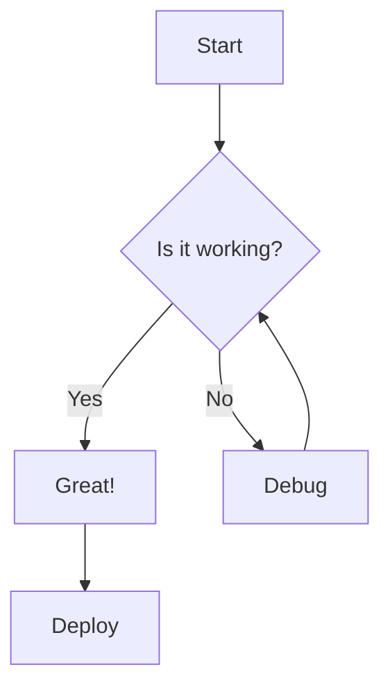

## Sequence Diagram

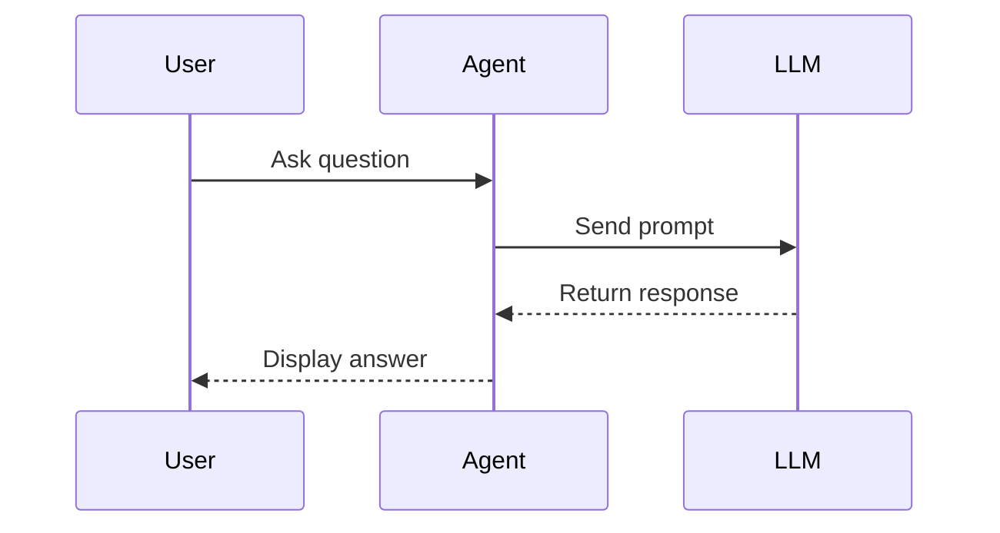

## Class Diagram

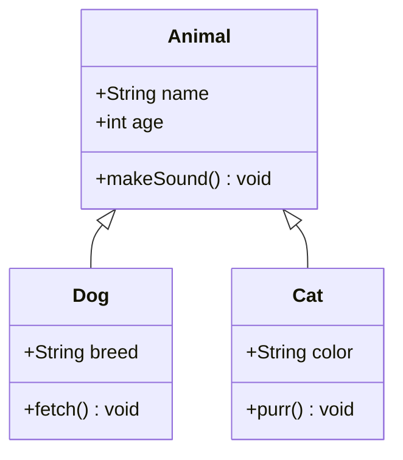

## State Diagram

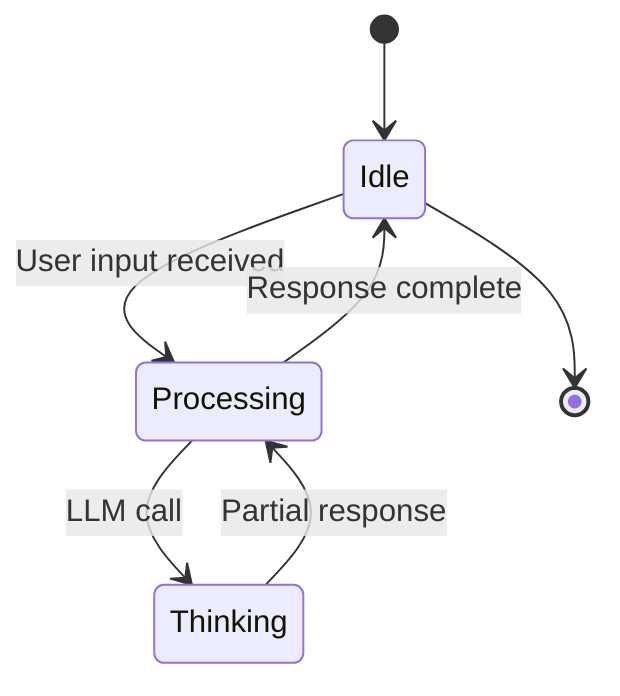

## Gantt Chart

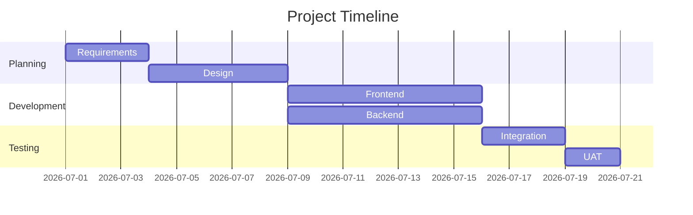

## Pie Chart

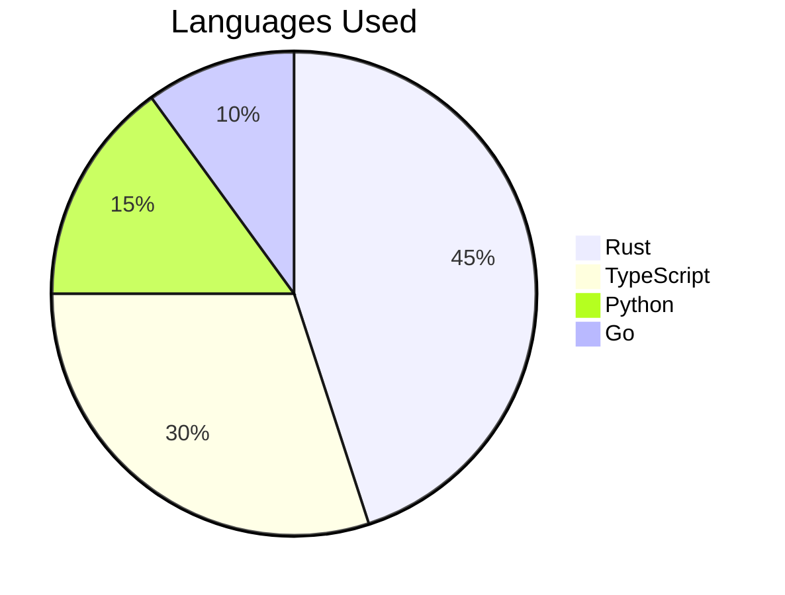

## Git Graph

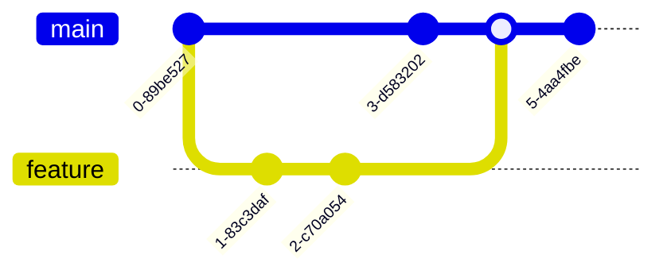

## Entity Relationship Diagram

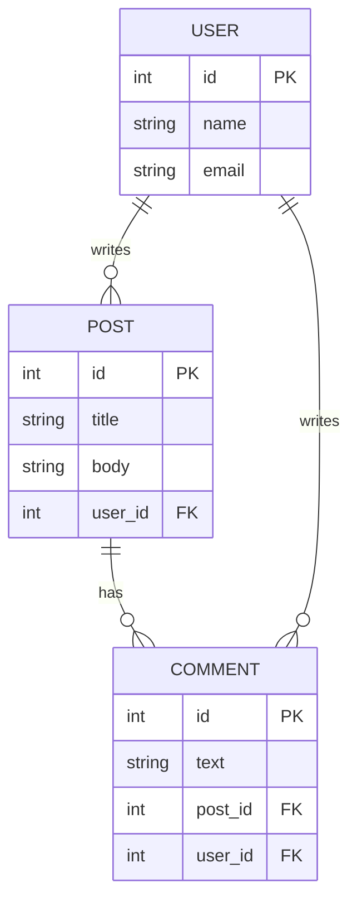

## Timeline

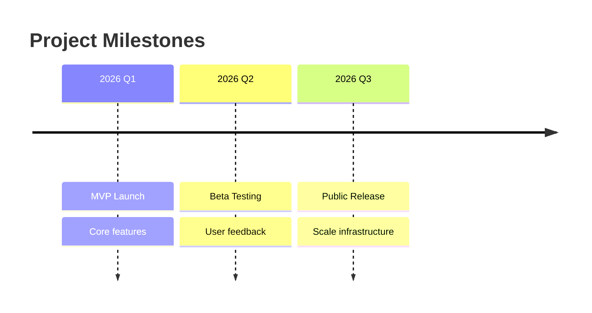

## Mindmap

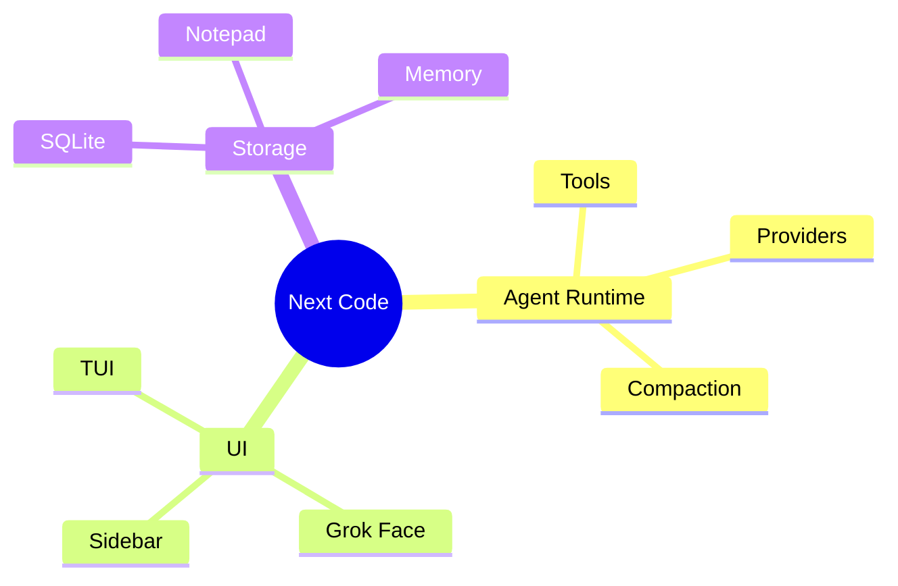

## Block Diagram

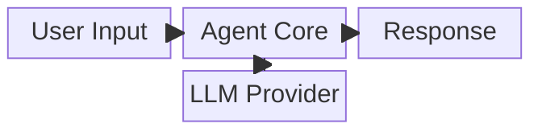

## Complex Flowchart

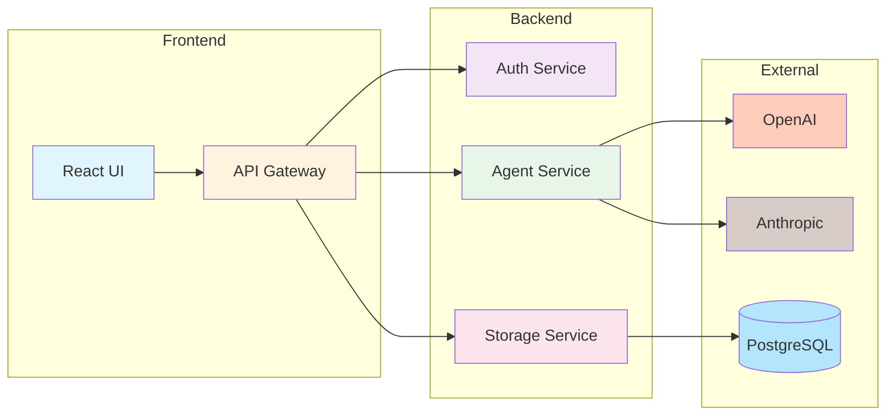
