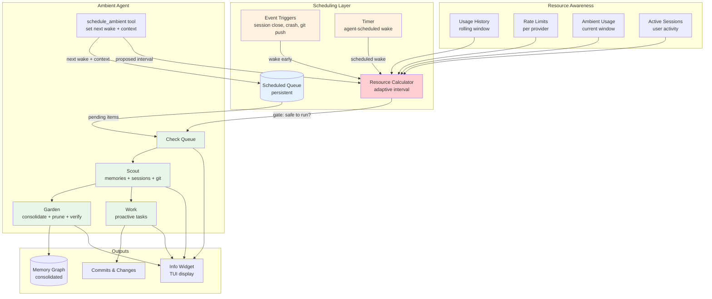
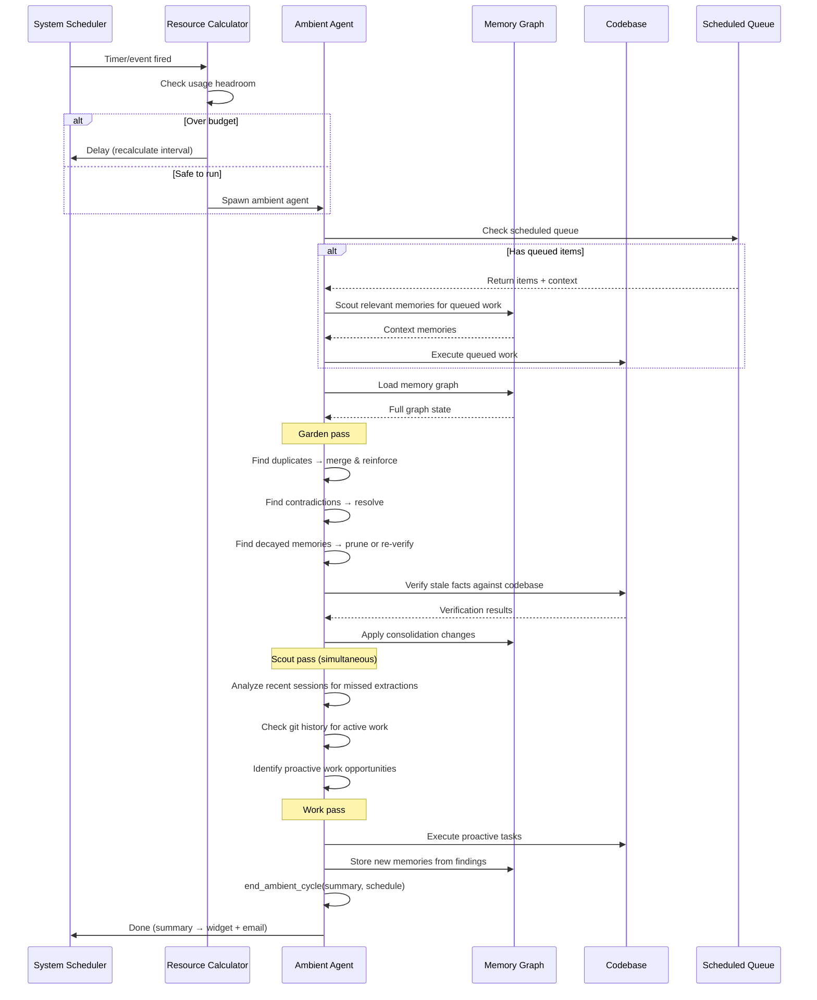
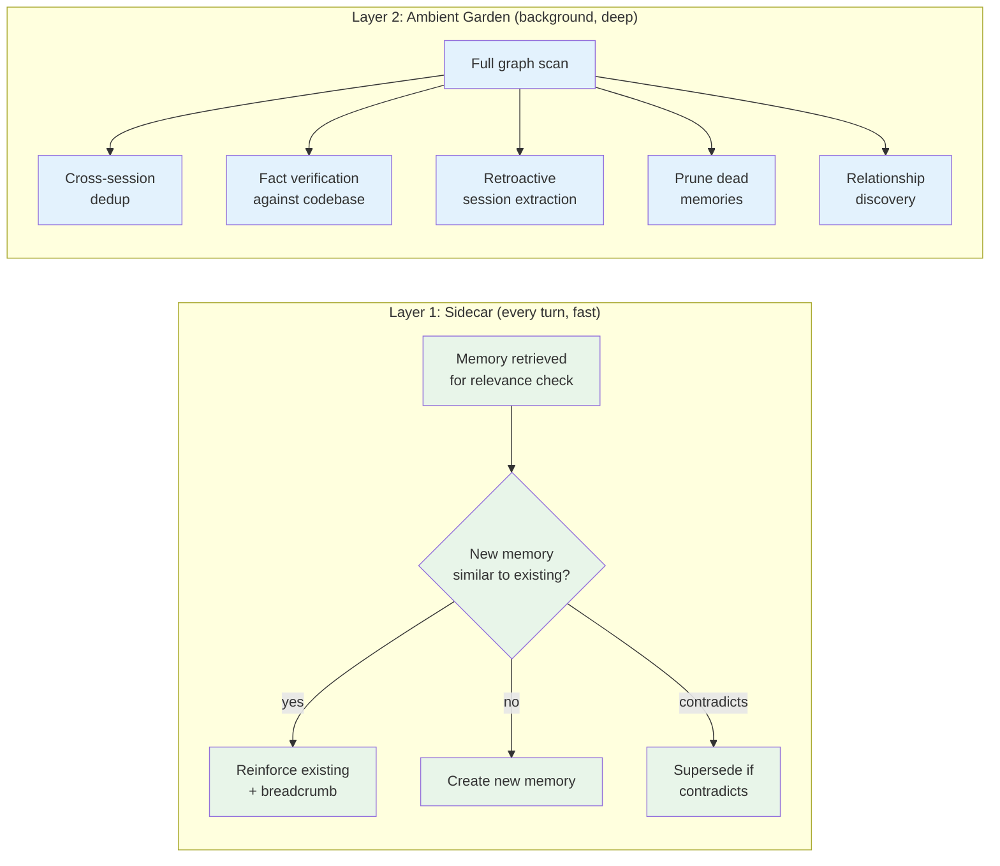
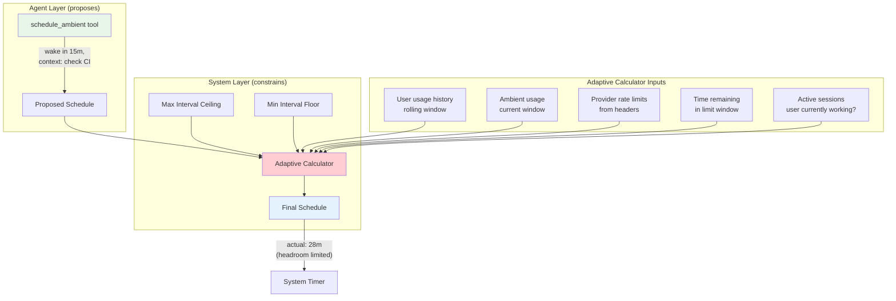
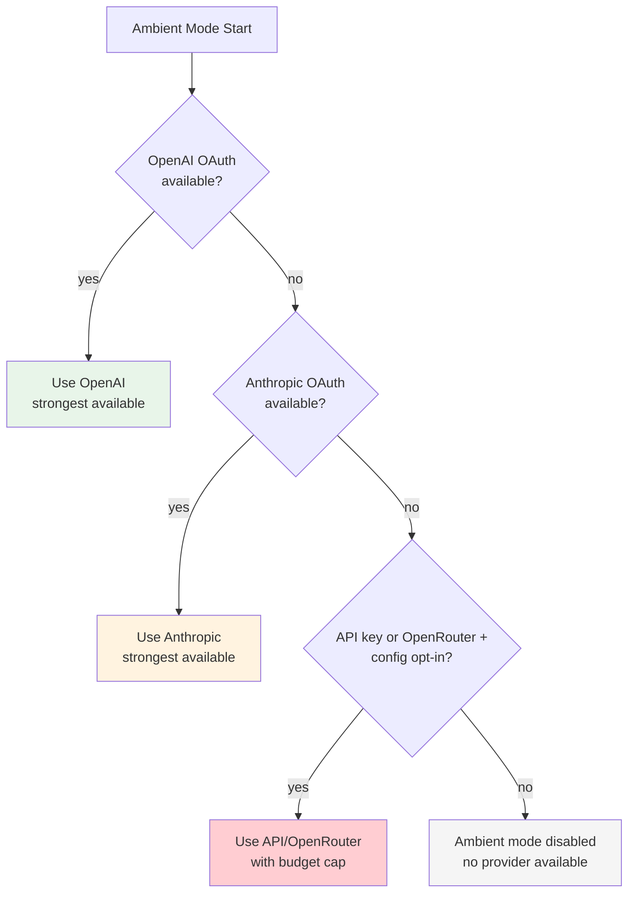
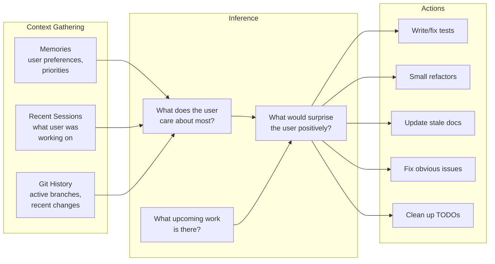
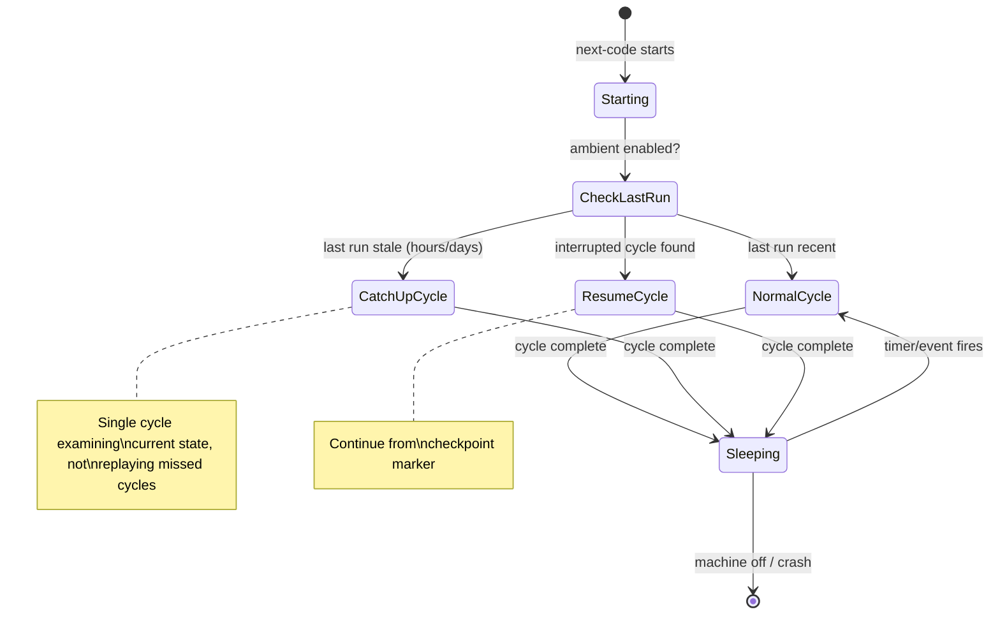

# Ambient Mode

> **Status:** Design
> **Updated:** 2026-02-08

A proactive, always-on agent mode that works autonomously without user prompting. Like a brain consolidating memories during sleep, ambient mode tends to the memory graph, identifies useful work, and acts on the user's behalf — all while staying within resource limits.

## Overview

Ambient mode operates as a background loop that:
1. **Gardens** — consolidates, prunes, and strengthens the memory graph
2. **Scouts** — analyzes recent sessions, git history, and memories to understand what the user cares about
3. **Works** — proactively completes tasks the user would appreciate being surprised by

These aren't separate phases. The agent does all three in a single pass — while looking at memories it naturally discovers maintenance work and identifies proactive opportunities simultaneously.

**Key Design Decisions:**
1. **Single agent at a time** — only one ambient instance ever runs, no parallelism
2. **Subscription-first** — defaults to OAuth (OpenAI/Anthropic), never uses API keys unless explicitly configured
3. **User priority** — interactive sessions always take precedence over ambient work
4. **Strong models** — uses the strongest available model from the selected provider so the agent can reason well about what's actually useful
5. **Self-scheduling** — the agent decides when to wake next, constrained by adaptive resource limits

---

## Architecture



---

## Ambient Cycle

Each ambient cycle follows a single flow. The agent doesn't switch between "modes" — it naturally handles gardening, scouting, and work in one pass.



---

## Ambient Agent Tools

The ambient agent has access to a subset of next-code tools plus ambient-specific tools.

### `end_ambient_cycle` (required)

Every ambient cycle **must** end with this tool call. The system uses the summary for the notification email and the info widget.

```rust
// Tool: end_ambient_cycle
{
    "summary": "Merged 3 duplicate memories, pruned 2 stale facts,
                extracted memories from crashed session next-code-red-fox-1234",
    "memories_modified": 8,
    "compactions": 2,
    "proactive_work": null,
    "next_schedule": {
        "wake_in_minutes": 25,
        "context": "Verify 4 remaining stale facts"
    }
}
```

| Field | Required | Description |
|-------|----------|-------------|
| `summary` | yes | Human-readable summary of what was done (goes into email/widget) |
| `memories_modified` | yes | Count of memories created/merged/pruned/updated |
| `compactions` | yes | Number of context compactions during this cycle |
| `proactive_work` | no | Description of proactive code changes, if any |
| `next_schedule` | no | When to wake next + context (falls back to system default if omitted) |

### `schedule_ambient`

Can also be called mid-cycle to queue future work:

```rust
// Tool: schedule_ambient
{
    "wake_in_minutes": 15,
    "context": "Check if CI passed for auth refactor PR",
    "priority": "normal"
}
```

### `todos`

The agent should use a todos tool to plan its cycle. This provides:
- Visibility into what the agent planned vs what it actually did
- If the cycle is interrupted, we know what's left
- Structure for the agent's reasoning

### `request_permission`

From the [Safety System](./SAFETY_SYSTEM.md). Used for any Tier 2 action.

---

## Handling Unexpected Stops

The model may stop unexpectedly (output length limit, API error, random stop). The system handles this:

```mermaid
stateDiagram-v2
    [*] --> Running: Cycle started

    Running --> Stopped: Model output ends

    Stopped --> CheckTool{Called end_ambient_cycle?}

    CheckTool --> Complete: Yes → normal completion
    CheckTool --> Continuation: No → send continuation message

    Continuation --> Running: Model continues work
    Continuation --> Stopped: Model stops again

    Stopped --> ForcedEnd: Second stop without end_ambient_cycle
    ForcedEnd --> Incomplete: Generate partial transcript,\nschedule default wake

    Complete --> [*]
    Incomplete --> [*]
```

**Continuation message** (injected as user message):

```
You stopped unexpectedly without calling end_ambient_cycle.
If you are done with your work, call end_ambient_cycle with a
summary of what you accomplished and schedule your next wake.
If you are not done, continue what you were doing.
```

**If no `end_ambient_cycle` is called after two attempts:**
- System generates a partial transcript marked as `incomplete`
- Compaction count is pulled from system metrics
- Default wake interval is scheduled
- Warning logged for debugging

**If no `schedule_ambient` or `next_schedule` in `end_ambient_cycle`:**
- System schedules a default wake at `max_interval_minutes` from config
- Warning logged — the agent should always schedule its next wake

---

## System Prompt

The ambient agent's system prompt is built dynamically each cycle with real data. The prompt gives the agent information to reason with, not rigid instructions for how to think.

```
You are the ambient agent for next-code. You operate autonomously without
user prompting. Your job is to maintain and improve the user's
development environment.

## Current State
- Last ambient cycle: {timestamp} ({time_ago})
- Machine was off/idle since: {if applicable}
- Active user sessions: {count, or "none"}
- Cycle budget: ~{estimated_max_tokens} tokens

## Scheduled Queue
{queued items with context, or "empty — do general ambient work"}

## Recent Sessions (since last cycle)
{for each session:
  - id, status (closed/crashed/active), duration, topic summary
  - extraction status (extracted/missed/partial)
}

## Memory Graph Health
- Total memories: {count} ({active} active, {inactive} inactive)
- Memories with confidence < 0.1: {count}
- Unresolved contradictions: {count}
- Memories without embeddings: {count}
- Duplicate candidates (similarity > 0.95): {count}
- Last consolidation: {timestamp}

## User Feedback History
{recent memories about ambient approval/rejection patterns}

## Resource Budget
- Provider: {name}
- Tokens remaining in window: {count}
- Window resets: {timestamp}
- User usage rate: {tokens/min average}
- Budget for this cycle: stay under {limit} tokens

## Instructions

Start by using the todos tool to plan what you'll do this cycle.

Priority order:
1. Execute any scheduled queue items first.
2. Garden the memory graph — consolidate duplicates, resolve
   contradictions, prune dead memories, verify stale facts,
   extract from missed sessions.
3. Scout for proactive work (only if enabled and past cold start) —
   look at recent sessions and git history to identify useful work
   the user would appreciate.

For gardening: focus on highest-value maintenance first. Duplicates
and contradictions before pruning. Verify stale facts only if you
have budget left.

For proactive work: be conservative. A bad surprise is worse than
no surprise. Check the user feedback memories — if they've rejected
similar work before, don't do it. Code changes must go on a worktree
branch with a PR via request_permission.

When done, you MUST call end_ambient_cycle with a summary of
everything you did, including compaction count. Always schedule
your next wake time with context for what you plan to do next.
```

---

## Usage Calculation

### Tracking

Every API call (user or ambient) is logged:

```rust
struct UsageRecord {
    timestamp: DateTime<Utc>,
    source: UsageSource,      // User | Ambient
    tokens_input: u32,
    tokens_output: u32,
    provider: String,
}
```

### Rate Limit Discovery

Rate limits are learned from provider response headers:

```
x-ratelimit-limit-requests: 50
x-ratelimit-remaining-requests: 42
x-ratelimit-limit-tokens: 100000
x-ratelimit-remaining-tokens: 85000
x-ratelimit-reset-requests: 2026-02-08T15:00:00Z
```

When headers aren't available, fall back to conservative defaults and adjust based on whether rate limit errors occur.

### Adaptive Interval Algorithm

```
# Known from headers or defaults
window_remaining = reset_time - now
tokens_remaining = ratelimit_remaining_tokens
requests_remaining = ratelimit_remaining_requests

# Estimate user consumption from rolling history
user_rate = rolling_average(
    usage_log.filter(source=User, last_hour),
    per_minute
)

# Project user usage for rest of window
user_projected = user_rate * window_remaining

# Reserve 20% buffer so user never feels throttled
ambient_budget = (tokens_remaining - user_projected) * 0.8

# Estimate cost per ambient cycle from recent cycles
tokens_per_cycle = rolling_average(
    recent_ambient_cycles.last(5).tokens_used
)

# How many cycles fit in remaining budget?
cycles_available = ambient_budget / tokens_per_cycle

# Spread evenly across remaining window
if cycles_available > 0:
    interval = window_remaining / cycles_available
else:
    interval = window_remaining  # wait for reset

# Clamp to configured bounds
interval = clamp(interval, min_interval, max_interval)
```

### Behavioral Rules

| Condition | Behavior |
|-----------|----------|
| User is active in a session | Pause ambient (or multiply interval by 3-5x) |
| User has been idle for hours | Run cycles more frequently |
| Hit a rate limit | Exponential backoff (double interval each time) |
| No rate limit errors for N cycles | Gradually decrease interval |
| No headers available | Start with 30min interval, adjust from errors |
| Approaching end of window with budget left | Squeeze in extra cycles |
| Over 80% of budget consumed | Fall back to max_interval |

---

## Memory Consolidation

### Two-Layer Architecture

Memory consolidation happens at two levels, mirroring how the brain encodes during the day and consolidates during sleep.



### Layer 1: Sidecar Consolidation

Runs after every turn, only on memories already retrieved for relevance checking. Zero added latency — runs after results are returned to the main agent.

**Operations:**
- **Duplicate detection** — if the sidecar is about to create a memory that's semantically identical to one it just retrieved, reinforce the existing one instead
- **Contradiction detection** — if a new memory contradicts an existing one in the retrieved set, supersede the old one
- **Reinforcement** — bump strength on memories that keep appearing relevant

**Cost:** Near zero. Only operates on memories already in hand.

### Layer 2: Ambient Garden

Deep consolidation that runs during ambient cycles. Has access to the full memory graph and codebase.

**Operations:**

| Operation | Description | Trigger |
|-----------|-------------|---------|
| **Graph-wide dedup** | Find semantically similar memories across entire graph | Embedding similarity > 0.95 |
| **Contradiction resolution** | Resolve `Contradicts` edges by checking current state | Contradicts edges exist |
| **Fact verification** | Check factual memories against codebase | Facts older than confidence half-life |
| **Retroactive extraction** | Analyze recent sessions that lack memory extraction | Sessions with status Crashed, Closed without extraction |
| **Pruning** | Remove memories with near-zero confidence and low strength | confidence < 0.05 AND strength <= 1 |
| **Relationship discovery** | Find new connections between memories | Co-occurrence in sessions, semantic similarity |
| **Embedding backfill** | Generate embeddings for memories that lack them | embedding is None |
| **Cluster refinement** | Re-run clustering on updated embeddings | Every N ambient cycles |

### Reinforcement Provenance

When a memory is reinforced (by sidecar or ambient), the system records a breadcrumb for traceability:

```rust
pub struct Reinforcement {
    pub session_id: String,
    pub message_index: usize,
    pub timestamp: DateTime<Utc>,
}

pub struct MemoryEntry {
    // ... existing fields ...
    pub reinforcements: Vec<Reinforcement>,
}

impl MemoryEntry {
    pub fn reinforce(&mut self, session_id: &str, message_index: usize) {
        self.strength += 1;
        self.updated_at = Utc::now();
        self.reinforcements.push(Reinforcement {
            session_id: session_id.to_string(),
            message_index,
            timestamp: Utc::now(),
        });
    }
}
```

The consolidation agent can later trace back through reinforcements to understand *why* a memory has the strength it does, and whether those reinforcements still hold.

---

## Scheduling

### Two-Layer Scheduling



### Agent-Initiated Scheduling

The ambient agent has a `schedule_ambient` tool to request its next wake-up:

```rust
// Tool: schedule_ambient
{
    "wake_in_minutes": 15,           // or "wake_at": "2026-02-08T15:30:00Z"
    "context": "Check if CI passed for auth refactor PR",
    "priority": "normal"             // "low" | "normal" | "high"
}
```

The context is stored in the scheduled queue so when the agent wakes up, it knows what it planned to do.

### Adaptive Resource Calculation

The system calculates the safe interval based on usage patterns:

```
headroom = rate_limit - (user_usage_rate + ambient_usage_rate)
safe_interval = max(min_interval, target_budget_fraction / headroom)
```

**Inputs:**
- **User usage rate** — rolling average of tokens/requests per hour from interactive sessions
- **Ambient usage rate** — tokens/requests consumed by ambient in current window
- **Rate limits** — known per-provider limits (from response headers or config)
- **Time in window** — how much of the rate limit window remains
- **Active sessions** — if user is currently in a session, ambient pauses or throttles heavily

**Behavior:**
- Agent says "wake in 10m" but system calculates "not safe until 30m" → pushed to 30m
- Agent says "wake in 6h" but system sees unused budget → pulled forward to max interval
- User starts interactive session → ambient pauses, resumes when user goes idle
- Approaching rate limit → ambient backs off exponentially

### Event Triggers

Certain events can wake ambient early (still subject to resource gate):

| Event | Priority | Rationale |
|-------|----------|-----------|
| Session crashed | High | Likely missed memory extraction |
| Session closed | Normal | May have unextracted memories |
| Git push | Low | Codebase changed, facts may be stale |
| User idle > threshold | Low | Good time for ambient work |
| Explicit `/ambient` command | Immediate | User requested |

### Scheduled Queue

Persistent queue of scheduled ambient tasks:

```rust
pub struct ScheduledItem {
    pub id: String,
    pub scheduled_for: DateTime<Utc>,
    pub context: String,
    pub priority: Priority,
    pub created_by_session: String,     // which ambient cycle created this
    pub created_at: DateTime<Utc>,
}

pub enum Priority {
    Low,
    Normal,
    High,
}
```

**Queue rules:**
- Checked first when ambient wakes up
- Items sorted by priority then scheduled time
- Expired items (past their scheduled_for) are still executed
- System can delay items if over budget, but won't drop them
- Only one ambient agent at a time — if one is running, new triggers queue up

---

## Provider & Model Selection

### Default Priority



**Rationale:**
- **OpenAI first** — separate rate limit pool from Anthropic, so ambient doesn't compete with interactive sessions
- **Anthropic second** — also subscription-based (OAuth), no per-token cost
- **OpenRouter/API keys last** — these are pay-per-token; opt-in only via config to avoid silently burning credits
- **Strong models** — ambient needs good judgment about what work is valuable. A weak model would do the wrong proactive work and annoy the user.

### Model Selection

| Provider | Default Model | Rationale |
|----------|--------------|-----------|
| OpenAI OAuth | Strongest available (e.g. `5.2-codex-xhigh`) | Best reasoning for judgment calls |
| Anthropic OAuth | Strongest available (e.g. `claude-opus-4-6`) | Best available on Anthropic |
| OpenRouter (opt-in) | Strongest available | Pay-per-token, requires config opt-in |
| API key (opt-in) | Configurable | User chooses cost/capability tradeoff |

### Resource Rules

1. **Subscription (OAuth — OpenAI/Anthropic):** Ambient is allowed, subject to adaptive rate limiting
2. **Pay-per-token (API keys, OpenRouter):** Off by default. Enable in config with optional daily budget cap
3. **User active:** Ambient pauses or throttles to minimum when user has an active session
4. **Rate limited:** If ambient hits a rate limit, back off aggressively (exponential backoff)
5. **Separate pools:** Prefer OpenAI for ambient when Anthropic is used interactively (and vice versa)

---

## Proactive Work

### What Ambient Does

The agent uses memories, recent sessions, and git history to identify useful work:



### Safety

Ambient mode operates under the [Safety System](./SAFETY_SYSTEM.md) — a human-in-the-loop layer that classifies actions, requests permission for anything risky, and notifies the user via email/SMS/desktop.

Key constraints for ambient:
- **All actions classified** — auto-allowed (read, local branches, memory ops), requires permission (PRs, pushes, communication), or always denied (force-push, delete remote branches)
- **Commits to a separate branch** — never pushes to main/master directly
- **Code changes require worktree + PR** — modifications always go through review
- **Small, focused changes** — no large refactors without user request
- **Session transcript** — full log of every action, sent as summary after each cycle
- **Respects .gitignore and sensitive files** — same security rules as interactive mode
- **Can be reviewed** — user sees ambient work in the TUI and pending permission requests

---

## Info Widget

The TUI displays ambient mode status alongside existing widgets (memory, tokens, etc.).

### Widget Content

```
╭─ Ambient ─────────────────────────╮
│ ● Running (garden + scout)        │
│ Queue: 2 items (next: check CI)   │
│ Last: 12m ago — pruned 3, merged 1│
│ Next: ~18m (adaptive)             │
│ Budget: ██████░░░░ 58% remaining  │
╰───────────────────────────────────╯
```

**Fields:**

| Field | Description |
|-------|-------------|
| **Status** | `idle` / `running (detail)` / `scheduled` / `paused (rate limited)` |
| **Queue** | Count of scheduled items + preview of next one's context |
| **Last cycle** | Time since last run + summary of what it did |
| **Next wake** | Estimated time until next cycle (from adaptive calculator) |
| **Budget** | Visual bar showing usage: user + ambient + remaining headroom |

### Budget Breakdown

The budget bar shows three segments:

```
User usage     Ambient usage    Remaining
████████████   ████             ░░░░░░░░░░
   45%           12%               43%
```

This gives the user immediate visibility into whether ambient is being too aggressive.

---

## Configuration

```toml
[ambient]
# Enable ambient mode (default: false until stable)
enabled = false

# Provider override (default: auto-select per priority chain)
# provider = "openai"

# Model override (default: provider's strongest)
# model = "5.2-codex-xhigh"

# Allow API key usage (default: false, only OAuth)
allow_api_keys = false

# Daily token budget when using API keys (ignored for OAuth)
# api_daily_budget = 100000

# Minimum interval between cycles in minutes (default: 5)
min_interval_minutes = 5

# Maximum interval between cycles in minutes (default: 120)
max_interval_minutes = 120

# Pause ambient when user has active session (default: true)
pause_on_active_session = true

# Enable proactive work (vs garden-only mode) (default: true)
proactive_work = true

# Proactive work branch prefix (default: "ambient/")
work_branch_prefix = "ambient/"
```

---

## Storage

```
~/.next-code/ambient/
├── state.json              # Current ambient state (status, last run, etc.)
├── queue.json              # Scheduled queue (persistent across restarts)
├── usage.json              # Usage history for adaptive calculation
└── logs/
    └── ambient-YYYY-MM-DD.log  # Daily ambient activity logs
```

---

## Context Window Management

Ambient mode uses the same compaction strategy as interactive sessions: **compact at 80% context window usage.** No special handling needed — if an ambient cycle is analyzing a large memory graph or many sessions, it compacts and continues.

---

## User Feedback via Memory

Ambient learns from the user's approval/rejection decisions through the memory system itself. No separate feedback mechanism is needed.

- **User rejects a proactive change** → ambient stores a memory: *"User rejected ambient PR to refactor auth tests — prefers not to have tests auto-modified"*
- **User approves** → memory: *"User approved ambient fixing typos in docs"*
- **Pattern emerges** → these memories get reinforced over time, naturally influencing what ambient prioritizes

This works because ambient already scouts memories before deciding what to do. Its own approval/rejection history becomes part of the context it reasons about, and these memories consolidate, decay, and reinforce like everything else in the graph.

---

## Crash Safety & Recovery

Ambient must assume the process can die at any point (battery death, crash, OOM, etc.) and design so nothing is lost or corrupted.

### Principles

- **Atomic writes** — memory graph and state files are written to a temp file first, then atomically renamed. A crash mid-write doesn't corrupt existing data.
- **Incremental checkpointing** — if ambient is halfway through gardening 50 memories and crashes, it shouldn't redo the ones already finished. A "last processed" marker tracks progress within a cycle.
- **Persistent queue survives crashes** — scheduled queue and permission requests are on disk, not in memory. They survive restarts.
- **Interrupted transcripts** — if a cycle doesn't complete, the transcript is marked as `interrupted` rather than `completed`, so the user knows it didn't finish.

### Recovery on Restart

When ambient starts after an unexpected shutdown:

1. **Don't replay missed cycles** — don't try to run every cycle that was scheduled while the machine was off. Just run one cycle that examines current state.
2. **Check time since last run** — if the gap is large (hours/days), there may be a backlog of crashed sessions to extract, stale memories to verify, etc. The agent handles this naturally since it always checks current state rather than diffing from last run.
3. **Expired scheduled items** — still execute them. The context the agent stored is still valid, the work is just late.
4. **Resume, don't restart** — if a cycle was interrupted mid-way, check the checkpoint and continue from where it left off rather than starting over.

### State Diagram



---

## Cold Start

First time ambient runs, there's no usage history, no patterns, no feedback memories. Bootstrapping strategy:

- **Start conservative** — garden-only (memory maintenance), no proactive work until ambient has enough context
- **Build usage baseline** — first few cycles just observe and track usage patterns for the adaptive scheduler
- **Proactive work unlocks gradually** — after N successful garden cycles with user-approved results, ambient can start scouting for proactive work
- **Or user opts in immediately** — config option to skip the warm-up if the user trusts it

---

## Per-Project Configuration

Some projects may need different ambient behavior (e.g. sensitive work projects, personal repos with different preferences):

```toml
# In project-level .next-code/config.toml
[ambient]
# Disable ambient entirely for this project
enabled = false

# Or restrict to garden-only (no proactive code changes)
proactive_work = false
```

---

## Multi-Machine (Deferred)

When ambient runs on multiple machines (e.g. laptop + desktop), shared state could conflict: double-processing sessions, conflicting memory edits, overlapping proactive work.

This is a distributed systems problem that will be addressed once ambient is stable on a single machine. Potential approaches:
- Machine ID on memory writes for conflict resolution
- Lock file or leader election for exclusive operations
- Git worktrees are already isolated, so proactive work is naturally conflict-free

---

## Implementation Phases

### Phase 1: Foundation
- [ ] Ambient agent loop (spawn, run, sleep)
- [ ] Single-instance guard
- [ ] Basic scheduling (fixed interval with max ceiling)
- [ ] Provider selection chain (OpenAI OAuth → Anthropic OAuth → pay-per-token opt-in → disabled)
- [ ] Configuration (`[ambient]` section in config)
- [ ] Storage layout

### Phase 2: Memory Consolidation — Garden
- [ ] Full graph-wide dedup scan
- [ ] Fact verification against codebase
- [ ] Retroactive session extraction (crashed/missed sessions)
- [ ] Pruning dead memories (low confidence + low strength)
- [ ] Relationship discovery across sessions
- [ ] Embedding backfill
- [ ] Contradiction resolution

### Phase 3: Scheduling
- [ ] `schedule_ambient` tool for agent self-scheduling
- [ ] Scheduled queue (persistent, with context)
- [ ] Adaptive resource calculator
- [ ] Usage history tracking
- [ ] Rate limit awareness (from provider response headers)
- [ ] Event triggers (session close, crash, git push)
- [ ] Active session detection → pause/throttle

### Phase 4: Proactive Work
- [ ] Scout: analyze recent sessions + git history
- [ ] Infer user priorities from memories
- [ ] Identify actionable work
- [ ] Execute on separate branch
- [ ] Report results

### Phase 5: Info Widget
- [ ] Ambient status display in TUI
- [ ] Queue preview
- [ ] Last cycle summary
- [ ] Next wake estimate
- [ ] Budget bar (user vs ambient vs remaining)

---

*Last updated: 2026-02-08*
