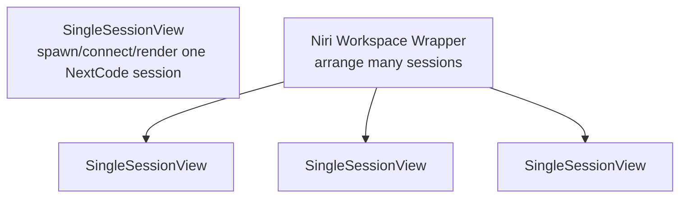

# Desktop Single Session Design

This document describes the visual target for the default `next-code-desktop` single-session mode.

## Layering

The single-session view is the primitive desktop surface. The Niri/workspace mode should later compose multiple single-session views rather than redefining what a session looks like.

## Typography

Primary font target:

- Family: `JetBrainsMono Nerd Font`
- Weight: `Light`
- Preferred fontconfig match: `JetBrainsMonoNerdFont-Light.ttf`
- Fallback family: `JetBrainsMono Nerd Font Mono`, then `JetBrains Mono`, then `monospace`

Rationale:

- Mono fits code, transcripts, tool output, and terminals.
- Light weight makes a dense agent session feel less heavy than the current blocky bitmap prototype.
- Nerd Font coverage gives us room for subtle icons/status glyphs later without switching fonts.

## Type scale

Initial target scale for a single session window:

| Role | Size | Weight | Notes |
| --- | ---: | --- | --- |
| Session title | 18 px | Light | Top left, preserves original case |
| Message body | 15 px | Light | Main transcript and assistant text |
| Metadata/status | 12 px | Light | Muted status, model, cwd, token/debug hints |
| Inline code/tool output | 14 px | Light | Same family, tighter line-height |

Line-height targets:

- Body: 1.45
- Code/tool output: 1.35
- Metadata: 1.25

## Rendering note

The current prototype uses a custom 5x7 bitmap text path in `render_helpers.rs`. That path is acceptable for layout exploration only. The next rendering pass should replace single-session text with a real font renderer that can:

1. Load `JetBrainsMonoNerdFont-Light.ttf` from fontconfig/system font paths.
2. Preserve casing and punctuation.
3. Shape/rasterize UTF-8 text, including Nerd Font glyphs.
4. Support alpha text over the existing WGPU surface.
5. Allow the workspace wrapper to reuse the same text renderer for each composed session.

## First visual goal

The default single-session window should read as one calm, focused coding conversation:

- No workspace lane/status strip.
- One content column.
- Large breathing room around the transcript.
- JetBrains Mono Light Nerd for every text element.
- Muted graphite text over the existing soft pastel background until a more final theme is chosen.
