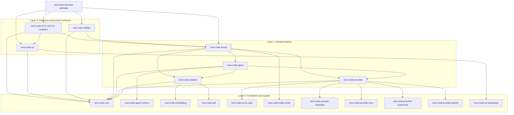

# Modular Architecture RFC

Status: Draft

This RFC describes a modular target architecture for next-code that matches the current codebase, preserves the existing product model, and gives us a safe migration path from today's mostly-monolithic root crate to a layered workspace.

It is intentionally aligned with:

- [`REFACTORING.md`](./REFACTORING.md)
- [`COMPILE_PERFORMANCE_PLAN.md`](./COMPILE_PERFORMANCE_PLAN.md)
- [`SERVER_ARCHITECTURE.md`](./SERVER_ARCHITECTURE.md)
- [`MULTI_SESSION_CLIENT_ARCHITECTURE.md`](./MULTI_SESSION_CLIENT_ARCHITECTURE.md)

## Goals

- Document the architecture that exists today, not an idealized version.
- Define a target layered and crate architecture that improves maintainability and compile times.
- Establish dependency rules that prevent the workspace from collapsing back into a monolith.
- Provide a phased migration plan that fits the refactoring roadmap and compile-performance plan.
- Preserve runtime behavior: one shared server, reconnecting clients, session-local self-dev capability, and stable tool/provider flows.

## Non-Goals

- A big-bang rewrite.
- Renaming every module or crate immediately.
- Forcing every subsystem into a separate crate before its boundaries are ready.
- Changing the core product architecture from single-server, multi-client.

## Executive Summary

Today, next-code is best described as a **modular monolith with a growing workspace shell**:

- The root `next-code` crate still owns most runtime orchestration and product behavior.
- Several heavy or relatively self-contained subsystems have already moved into workspace crates.
- The codebase has strong module-level separation in some areas, but several broad root modules still act as architectural chokepoints.

The target architecture is a **layered workspace**:

1. **Foundation layer** for stable shared types and runtime primitives.
2. **Domain/runtime layer** for session, agent, provider, and server logic.
3. **Interface layer** for CLI, TUI, self-dev, and optional heavy integrations.
4. **Composition layer** where the top-level `next-code` package wires the product together.

The most important design rule is this:

> High-churn orchestration code must depend on stable lower layers, while stable lower layers must never depend back on runtime/UI/product-specific code.

That rule serves both architecture quality and compile-speed goals.

## Current Architecture

### Current runtime model

At the product level, the runtime architecture is already clear:

- `next-code` is a **single-server, multi-client** application.
- The server owns sessions, swarm state, background tasks, provider state, and shared services.
- Clients are primarily TUI frontends that attach to server-owned sessions.
- Self-dev is session-local capability on the shared server, not a separate architecture.

That model should stay intact.

### Current code organization

The current code organization is mixed:

- **Root crate `next-code`** still contains most product logic.
- **Workspace crates** already isolate several heavy or stable seams.
- **Subdirectories under `src/`** increasingly reflect domain boundaries, especially for `agent`, `cli`, `server`, `tool`, and `tui`.

Current workspace members from `Cargo.toml` are grouped roughly as follows:

- root package: `next-code`
- foundation/runtime support: `next-code-agent-runtime`, `next-code-core`, `next-code-storage`, `next-code-terminal-launch`, `next-code-tool-core`
- data-contract crates: `next-code-ambient-types`, `next-code-auth-types`, `next-code-background-types`, `next-code-batch-types`, `next-code-config-types`, `next-code-gateway-types`, `next-code-memory-types`, `next-code-message-types`, `next-code-selfdev-types`, `next-code-session-types`, `next-code-side-panel-types`, `next-code-task-types`, `next-code-tool-types`, `next-code-usage-types`
- protocol and planning: `next-code-protocol`, `next-code-plan`
- heavy or optional integrations: `next-code-embedding`, `next-code-pdf`, `next-code-notify-email`
- auth and providers: `next-code-azure-auth`, `next-code-provider-core`, `next-code-provider-metadata`, `next-code-provider-openrouter`, `next-code-provider-gemini`
- TUI extraction seams: `next-code-tui-core`, `next-code-tui-markdown`, `next-code-tui-mermaid`, `next-code-tui-render`, `next-code-tui-workspace`
- product surfaces outside the main TUI binary: `next-code-desktop`

### What the root crate still owns

The root crate still directly owns most of the following concerns:

- CLI parsing and dispatch
- server orchestration and socket lifecycle
- session state and persistence
- agent turn execution and tool orchestration
- provider implementation composition and runtime provider wiring; the shared `Provider` trait now lives in `next-code-provider-core`
- protocol/message/config types
- tool registry and many tool implementations
- TUI application state and rendering
- auth, memory, safety, ambient mode, and product glue

This is why the root crate is still the primary compile and architecture hotspot.

### Existing extracted workspace seams

These splits already exist and should be treated as real architectural footholds, not temporary accidents:

| Crate | Current role |
|---|---|
| `next-code-agent-runtime` | shared interrupt and lightweight runtime primitives for agent execution |
| `next-code-ambient-types` | usage and rate-limit records shared by ambient/background flows |
| `next-code-auth-types` | provider-neutral auth state and credential metadata |
| `next-code-background-types` | background-task status and progress DTOs |
| `next-code-batch-types` | batch tool progress DTOs, currently depending only on message types internally |
| `next-code-config-types` | stable configuration data contracts |
| `next-code-core` | low-level utilities such as IDs, env helpers, fs helpers, stdin detection, and formatting |
| `next-code-gateway-types` | gateway-facing data contracts |
| `next-code-memory-types` | memory subsystem data contracts |
| `next-code-message-types` | message content and transport-adjacent data contracts |
| `next-code-protocol` | client/server protocol surface built from stable type crates and provider-core values |
| `next-code-plan` | plan/task graph data model shared across coordination flows |
| `next-code-selfdev-types` | self-development request/status data contracts |
| `next-code-session-types` | session DTOs, currently depending only on message types internally |
| `next-code-side-panel-types` | side-panel page and update data contracts |
| `next-code-task-types` | task/tool scheduling data contracts |
| `next-code-tool-core` | runtime tool contracts such as the `Tool` trait and execution context |
| `next-code-tool-types` | stable tool output/image DTOs |
| `next-code-usage-types` | usage accounting data contracts |
| `next-code-storage` | storage helpers layered on `next-code-core` |
| `next-code-embedding` | ONNX/tokenizer-based embedding implementation and heavy inference deps |
| `next-code-pdf` | PDF text extraction |
| `next-code-azure-auth` | Azure bearer token retrieval |
| `next-code-notify-email` | SMTP/IMAP/mail transport |
| `next-code-provider-metadata` | provider/login catalog and profile metadata |
| `next-code-provider-core` | shared provider contract (`Provider`/`EventStream`), value types, route/cost/model helpers, shared HTTP client, schema helpers |
| `next-code-provider-openrouter` | OpenRouter-specific catalog/cache/support helpers |
| `next-code-provider-gemini` | Gemini schema/model/support helpers |
| `next-code-tui-core` | low-level terminal UI primitives that do not need full app state |
| `next-code-tui-markdown` | markdown wrapping/rendering, layered on mermaid/workspace support |
| `next-code-tui-mermaid` | mermaid parsing, rendering, caching, viewport, and widget support |
| `next-code-tui-render` | reusable TUI layout/render helpers |
| `next-code-tui-workspace` | workspace-map data/model/widget rendering |
| `next-code-terminal-launch` | terminal process launch helpers |
| `next-code-desktop` | desktop app surface and session/workspace rendering experiments |

These are already aligned with the compile-performance plan's strategy: isolate heavy dependencies and stable helper surfaces first.

### Current chokepoints

The root crate still has several broad, high-fanout modules that make both maintenance and incremental compilation harder. Current sizes observed from the tree:

- `src/server.rs`: ~1731 lines
- `src/provider/mod.rs`: ~2283 lines
- `src/session.rs`: ~2730 lines
- `src/protocol.rs`: ~1198 lines
- `src/main.rs`: ~55 lines

This supports the current plan direction:

- CLI decomposition is already mostly underway and should continue.
- Server, provider, session, and TUI state boundaries remain the most important structural work.
- The top-level binary entrypoint is already close to the desired thin composition shape.

### Current architecture in one picture

```mermaid
flowchart TD
  J[next-code root crate]

  J --> CLI[CLI and startup]
  J --> Server[Server orchestration]
  J --> Session[Session and persistence]
  J --> Agent[Agent turn loop and tools]
  J --> Provider[Provider trait and runtime impls]
  J --> TUI[TUI app and rendering]
  J --> Coreish[Protocol, message, config, ids]
  J --> Product[Auth, memory, safety, ambient, notifications]

  J --> AR[next-code-agent-runtime]
  J --> Emb[next-code-embedding]
  J --> PDF[next-code-pdf]
  J --> Azure[next-code-azure-auth]
  J --> Mail[next-code-notify-email]
  J --> PMeta[next-code-provider-metadata]
  J --> PCore[next-code-provider-core]
  J --> POR[next-code-provider-openrouter]
  J --> PGem[next-code-provider-gemini]
  J --> TW[next-code-tui-workspace]
```



## Architectural Problems To Solve

### 1. The root crate is still the product and the platform

Today the root crate acts as all of the following at once:

- domain model holder
- runtime orchestrator
- UI host
- provider abstraction layer
- integration shell
- compile boundary for unrelated edits

That makes it hard to reason about ownership and easy to create accidental coupling.

### 2. Stable types and high-churn orchestration still live together

Broadly reused types like protocol structures, message forms, IDs, route metadata, and config types should be more stable than server, TUI, or provider orchestration logic. Today many of these still live in the same crate and sometimes in the same dependency fanout path.

### 3. Some boundary slices exist, but the center remains too wide

The existing workspace crates are good first splits, but they mostly isolate leaves. The center of gravity is still inside the root crate, especially around:

- session state
- provider runtime behavior and concrete provider composition
- server lifecycle
- tool registry wiring
- TUI app state and reducers

### 4. Compile-speed and architecture incentives are the same problem

The compile-performance plan is correct that crate boundaries matter most. The same boundaries that reduce invalidation pressure also improve ownership and testability.

## Target Architecture

### Layered model

The target is a layered workspace with a thin composition root. Arrows below mean
"depends on".



The exact crate names can evolve, but the dependency direction should not.

## Optimal compile-oriented workspace shape

The optimal crate structure is not "one crate per folder". The target should optimize for three forces at the same time:

1. **Invalidation boundaries:** high-churn edits should not rebuild unrelated stable subsystems.
2. **Dependency weight boundaries:** heavy dependencies should sit behind leaf crates or opt-in features.
3. **Ownership boundaries:** each crate should have one reason to change and a small public API.

The current root-crate size distribution makes the main opportunity clear: `src/tui`, `src/server`, `src/tool`, `src/provider`, `src/cli`, and `src/auth` dominate root-crate lines. Splitting only tiny helpers is useful as a safe staging tactic, but the long-term win is moving these high-churn domains behind stable lower-layer contracts.

### Desired final crate families

#### 1. Contract/type crates

These crates should be small, low-dependency, and slow-changing. They are allowed to be depended on broadly.

Existing examples:

- `next-code-message-types`
- `next-code-tool-types`
- `next-code-session-types`
- `next-code-config-types`
- `next-code-protocol`
- `next-code-provider-core`
- `next-code-plan`
- `next-code-*-types`

Target direction:

- Keep these crates boring and DTO-heavy.
- Prefer `serde`, `chrono`, and small utility dependencies only.
- Avoid `tokio`, `reqwest`, `ratatui`, provider SDKs, storage paths, and product orchestration.
- If a type requires a service handle, task runtime, channel sender, or filesystem layout, it is probably not a pure contract type.

Compile-time reason:

- These crates will be rebuilt whenever public contracts change, so they must change rarely.
- They allow `server`, `tui`, `agent`, and `provider` crates to talk without depending on the root crate.

#### 2. Domain/runtime crates

These own product behavior but should depend only downward on contracts/support crates.

Target crates:

- `next-code-provider`: provider composition, provider routing, streaming contract adapters, and concrete runtime implementations layered on the `next-code-provider-core` trait.
- `next-code-agent`: turn loop, compaction orchestration, provider/tool interaction, recovery logic.
- `next-code-session`: session model, state transitions, persistence-facing session operations.
- `next-code-server`: daemon lifecycle, client attachment, swarm/background coordination, service registries.
- `next-code-tools` or narrower `next-code-tool-core` plus `next-code-tool-impl`: tool registry contracts and tool implementations.
- `next-code-auth`: root auth orchestration after provider-neutral data lives in `next-code-auth-types` and heavy leaf SDKs stay separate.
- `next-code-memory`: memory graph/log/search orchestration once its contracts are stable enough.

Compile-time reason:

- These are the main root invalidation hotspots.
- They should become independent enough that an edit in TUI rendering does not rebuild provider implementations, and an edit in provider routing does not rebuild server socket lifecycle.

#### 3. Interface/product crates

These are high-churn application surfaces and should sit above runtime/domain crates.

Target crates:

- `next-code-cli`: parsing and command dispatch if CLI keeps growing.
- `next-code-tui`: app state, reducers, key handling, command/input handling, UI orchestration.
- `next-code-desktop`: already a separate surface.
- `next-code-selfdev`: self-dev build/reload/customization workflows if they remain a substantial product surface.

Compile-time reason:

- UI and CLI are edited frequently. Their churn should not force recompilation of stable server/provider/session internals.
- TUI should depend on protocol/service contracts, not on concrete server internals.

#### 4. Heavy leaf adapter crates

These should remain isolated and often feature-gated.

Existing examples:

- `next-code-embedding`
- `next-code-pdf`
- `next-code-azure-auth`
- `next-code-notify-email`
- `next-code-tui-mermaid`
- provider support crates such as `next-code-provider-openrouter` and `next-code-provider-gemini`

Target direction:

- Keep heavy dependencies out of the root crate and out of broadly shared contracts.
- Prefer opt-in features when the product can degrade gracefully.
- Keep a thin root/domain facade when runtime integration still belongs at a higher layer.

Compile-time reason:

- Heavy crates are fine when cached, but terrible when dragged into unrelated rebuilds.
- Feature-gated leaves make local inner loops cheaper without removing full-product builds.

#### 5. Composition package

The top-level `next-code` package should eventually become mostly:

- binary entrypoints
- feature defaults
- runtime graph assembly
- compatibility re-exports/facades during migration
- product configuration and packaging defaults

It should not be the long-term home of large implementation modules.

### Recommended dependency direction

A healthy final graph should look like this:

```text
next-code binary/composition
  -> next-code-cli, next-code-tui, next-code-server, next-code-selfdev

next-code-cli / next-code-tui
  -> next-code-protocol, next-code-*-types, next-code-server-client contracts

next-code-server
  -> next-code-agent, next-code-session, next-code-provider, next-code-tools, next-code-storage

next-code-agent
  -> next-code-provider, next-code-tools, next-code-session, next-code-agent-runtime

next-code-provider
  -> next-code-provider-core, next-code-provider-* leaves, next-code-auth-types

next-code-session
  -> next-code-session-types, next-code-message-types, next-code-storage, optional leaf adapters

contract/type crates
  -> serde and small support crates only
```

The forbidden direction is just as important:

- contract crates must not depend on runtime/domain crates
- provider crates must not depend on TUI or server crates
- TUI crates must not depend on concrete server internals when protocol/client contracts are sufficient
- leaf adapter crates must not become backdoors into the root crate
- the root crate should not be required by workspace peers except temporarily during migration

### Split readiness checklist

A root module is ready to become a crate when most of these are true:

- Its public API can be described in less than a page.
- It does not need to call back into arbitrary root modules.
- Its dependencies are either lower-layer contracts or intentionally owned leaf adapters.
- Tests can run at the crate level without booting the full product.
- A touched-file benchmark shows it is on a meaningful invalidation path.
- It has a stable facade in the root crate for compatibility during migration.

If these are not true yet, keep decomposing internally first.

### What not to do

Avoid these tempting but harmful structures:

- **One mega `next-code-common` crate.** It becomes the new root crate and invalidates everything.
- **One crate per source directory.** This creates noisy APIs and dependency cycles without compile wins.
- **Moving high-churn traits too early.** A poorly stabilized trait crate can become worse than the monolith.
- **Moving UI-adjacent state into core.** This contaminates lower layers with `ratatui`/terminal concepts.
- **Provider leaf crates depending on root.** That prevents the root from ever becoming a composition shell.
- **Splitting by dependency weight only.** Heavy leaf isolation is good, but ownership and API stability matter too.

### Highest-ROI next crate seams from the current tree

Based on the current root size and existing footholds, the best next work is probably:

1. **Provider contracts:** keep shrinking `src/provider/mod.rs` until a `next-code-provider` trait/runtime crate can depend only on `next-code-message-types`, `next-code-provider-core`, and small runtime primitives.
2. **Server core:** extract protocol-independent pieces of `src/server/` such as client lifecycle state machines, swarm/background coordination DTOs, and reload/update policies behind server-local contracts.
3. **TUI reducer/state core:** extract non-rendering app state transitions from `src/tui/app/*` before moving the whole TUI crate.
4. **Tool contracts and registry shape:** separate tool definitions, schemas, execution context, and registry metadata from individual tool implementations.
5. **Session domain:** isolate session state transitions and persistence-facing operations from server/TUI/provider orchestration.
6. **Auth facade:** keep provider-neutral auth data in `next-code-auth-types`, heavy SDKs in leaf crates, and move root auth orchestration only after provider contracts stabilize.

A useful near-term policy: every time a large root file is touched, ask whether some pure table, DTO, parser, reducer, classifier, or state transition can move downward into an existing support crate without pulling runtime dependencies with it.

### Compile-time success metrics

Each structural phase should record at least:

- touched-file `cargo check` for the edited hotspot
- touched-file selfdev build for the edited hotspot
- `cargo tree -p next-code --edges normal --depth 1` before/after for dependency surprises
- crate-level test coverage for newly extracted crates

A split is successful if it either:

- lowers warm touched-file times for common edits, or
- prevents unrelated heavy crates from rebuilding when the root changes, or
- makes the next larger extraction materially safer.

A split should be reconsidered if it adds public API churn, creates cycles, or requires broad root re-exports that hide the actual dependency direction.

## Target crate responsibilities

### `next-code-core`

Purpose: stable shared types and utilities with minimal dependencies.

Should contain:

- IDs and naming primitives
- protocol DTOs that are not server-implementation-specific
- message/content/tool-definition types shared across runtime layers
- config primitives and enums that do not require runtime services
- small shared utility types with high reuse

Should not contain:

- TUI code
- server lifecycle code
- provider network code
- tokio task orchestration unless truly unavoidable
- product-specific wiring

Notes:

- This is the most important future extraction because it enables the rest.
- `src/protocol.rs`, `src/id.rs`, and carefully selected parts of `config.rs` and `message.rs` are the likely first feeders.

### `next-code-session`

Purpose: session domain model, persistence, and state transitions.

Should contain:

- session model and persisted metadata
- session storage/loading/snapshot logic
- reducer-like state transitions for session-owned data
- memory extraction hooks that are session-domain concerns

Should not contain:

- socket handling
- TUI state
- provider HTTP details
- direct server daemon lifecycle logic

Notes:

- This crate is not explicitly named in the current compile-performance plan, but the current size and fanout of `src/session.rs` make session extraction a natural stabilizing move.
- If introducing `next-code-session` feels too early, the same boundary should still be established internally first and extracted later.

### `next-code-provider`

Purpose: provider contracts and runtime-facing provider orchestration.

Should contain:

- the `Provider` trait once it depends only on lower-layer types
- provider routing abstractions
- runtime-facing provider composition
- shared streaming abstractions for provider results

Should not contain:

- provider-specific heavy catalogs and schema helpers that already live well in leaf crates
- server or TUI logic

Notes:

- Existing crates `next-code-provider-core`, `next-code-provider-metadata`, `next-code-provider-openrouter`, and `next-code-provider-gemini` remain useful under this layer.
- The key migration step is shrinking the `Provider` trait's dependency surface so it no longer depends on root-crate-only message/runtime types.

### `next-code-agent`

Purpose: agent turn engine and tool orchestration.

Should contain:

- turn-loop engine
- stream handling and response recovery
- tool execution orchestration
- compaction integration
- prompt assembly inputs that are agent-domain concerns

Should not contain:

- server socket lifecycle
- TUI state
- provider-specific leaf implementations

Notes:

- This aligns directly with the refactoring roadmap's "Agent Turn-Loop Unification" phase.
- `next-code-agent-runtime` remains the low-level runtime primitive crate below it.

### `next-code-server`

Purpose: daemon lifecycle and multi-client coordination.

Should contain:

- socket listeners and debug socket handling
- client attach/detach lifecycle
- swarm coordination
- reload/update server behaviors
- server-owned registries and shared service wiring

Should not contain:

- TUI rendering
- provider implementation details beyond service interfaces
- session persistence internals that belong in `next-code-session`

Notes:

- The current `src/server/` submodule tree is already the right shape for this extraction.
- `src/server.rs` should continue shrinking into a facade/composition module.

### `next-code-tui`

Purpose: client UI state, reducers, and rendering.

Should contain:

- app state and reducers
- remote client behavior and reconnect logic
- renderer/widget orchestration
- TUI-specific command/input handling

Should not contain:

- server daemon code
- session persistence internals
- provider network logic

Notes:

- This aligns directly with the refactoring roadmap's "TUI State/Reducer Split" phase.
- `next-code-tui-workspace` can remain a leaf crate or become a child dependency of `next-code-tui`.

### `next-code-selfdev`

Purpose: self-dev workflows, customization records, reload/build productization.

Should contain:

- self-dev state and tooling policy
- build/reload orchestration specific to self-dev workflows
- customization record and migration logic as it lands

Should not contain:

- generic server lifecycle not specific to self-dev
- general TUI rendering

Notes:

- This aligns with the compile-performance plan's issue-#32 direction and with the already-unified shared-server model.

### `next-code` top-level package

Purpose: composition root and shipping product package.

Should eventually be responsible for:

- binary entrypoints
- feature/default selection
- wiring the runtime graph together
- packaging and product defaults

It should not remain the long-term home of most implementation logic.

## Dependency Rules

These rules are the core of the RFC.

### Rule 1: Dependencies flow downward only

A higher layer may depend on a lower layer. A lower layer may not depend on a higher layer.

- foundation cannot depend on domain/runtime, interfaces, or product crates
- domain/runtime cannot depend on TUI or self-dev UI/product layers
- leaf adapters must not pull UI or server concerns downward

### Rule 2: No TUI types below the interface layer

- `ratatui`, `crossterm`, renderer state, viewport state, widget models, and clipboard/image/UI helper types must stay out of server, agent, provider, and core crates
- server-to-client data crosses the boundary via protocol/event types, not TUI structs

### Rule 3: No server daemon types in core or provider-support crates

- socket/session attachment state, fanout senders, debug socket helpers, and daemon lifecycle code must not appear in `next-code-core`, `next-code-provider-core`, or provider leaf crates

### Rule 4: Provider implementation crates depend on contracts, not on the server or TUI

- provider leaf crates may depend on `next-code-core`, `next-code-provider`, and `next-code-provider-core`
- they must not depend on `next-code-server` or `next-code-tui`

### Rule 5: Async/network-heavy dependencies do not belong in `next-code-core`

`next-code-core` should stay cheap to compile and highly reusable.

Avoid putting these there unless absolutely necessary:

- `reqwest`
- provider SDKs
- UI crates
- ONNX/tokenizer stacks
- mail/PDF dependencies

### Rule 6: Stable contracts should change more slowly than orchestration

Before extracting a crate, first shrink and stabilize its public surface.

Examples:

- move pure data types before moving stateful runtime code
- move pure helper functions before moving integration shells
- keep facades in the root crate during transitions if they reduce churn

### Rule 7: Avoid cross-cutting "utils" crates

Do not create a dumping-ground crate.

If code has a clear owner, it belongs with that owner:

- protocol/data types -> `next-code-core`
- session persistence -> `next-code-session`
- provider route/schema helpers -> provider crates
- rendering helpers -> `next-code-tui`

### Rule 8: The root package may compose many crates, but peer crates should stay narrow

The top-level `next-code` package can wire multiple domains together. Peer crates should not casually depend on each other sideways when a lower-level contract would do.

### Rule 9: New crate boundaries should follow both ownership and invalidation logic

A crate split is worth doing when it improves at least one of these substantially, and ideally both:

- clearer ownership and testability
- lower compile invalidation for common edits

### Rule 10: Preserve behavior with facades during migration

During migration, it is acceptable for the root crate to keep temporary facade modules that re-export or forward into extracted crates. That is preferable to risky behavior changes.

## Recommended Target Mapping From Today's Code

This is the recommended direction from the current tree, not a one-shot move list.

| Current area | Likely target |
|---|---|
| `src/id.rs`, protocol/message/config primitives | `next-code-core` |
| `src/session.rs`, parts of `storage`, restart snapshot concerns | `next-code-session` |
| `src/agent/*`, parts of `compaction`, tool orchestration seams | `next-code-agent` |
| `src/server/` + shrinking `src/server.rs` facade | `next-code-server` |
| `src/provider/mod.rs` trait/contracts plus provider composition seams | `next-code-provider` |
| existing provider helper crates | remain leaf/provider support crates |
| `src/tui/*` + `next-code-tui-workspace` | `next-code-tui` + leaf workspace widget crate |
| `src/cli/*` | stay in root initially or become `next-code-cli` later if justified |
| `src/tool/selfdev/*`, self-dev workflow/productization | `next-code-selfdev` |

## Phased Migration Plan

This migration is intentionally incremental and aligned with existing docs.

### Phase 0: Codify the architecture now

Deliverables:

- this RFC
- cross-links from refactoring and compile-performance docs
- dependency rules documented before more splits land

Why now:

- the repo already has enough workspace structure that undocumented drift is becoming more expensive

### Phase 1: Finish internal module decomposition in the root crate

Aligns with `REFACTORING.md` phases 2 through 6.

Focus areas:

- continue CLI decomposition until `main()` stays parse + runtime bootstrap only
- continue shrinking `src/server.rs` into a thin facade over `src/server/*`
- unify agent turn-loop variants behind one engine
- continue TUI state/reducer separation
- continue provider state isolation and pure helper extraction

Exit criteria:

- root modules are organized by ownership, not by convenience
- candidate extraction seams are obvious and lower-risk

### Phase 2: Extract `next-code-core`

This is the highest-leverage shared boundary.

First moves should be narrow and stable:

- IDs
- small protocol DTOs
- tool definition and message content forms that are broadly shared
- config enums/primitives that do not need runtime services

Avoid moving unstable orchestration APIs too early.

Exit criteria:

- server, agent, provider, and TUI code can all depend on the same lower-level shared types without depending on the root crate

### Phase 3: Extract runtime/domain crates

Primary targets:

1. `next-code-provider`
2. `next-code-agent`
3. `next-code-server`
4. `next-code-session`

Recommended order:

- start with whichever boundary is already most internally modular after Phase 1
- in practice, provider and server look like the strongest current candidates because they already have meaningful submodule trees and leaf support crates
- session may remain internal slightly longer if its public surface is still too entangled

Exit criteria:

- the root crate no longer defines the main provider, server, and agent contracts directly

### Phase 4: Extract `next-code-tui`

Focus:

- move client app/reducer/rendering code out of the root crate once protocol and runtime service boundaries are stable
- keep server events and client view-state concerns separated by protocol types

This phase should happen after enough shared contract extraction exists to avoid TUI depending back on root implementation details.

Exit criteria:

- TUI can evolve rapidly without dragging broad server/provider recompilation

### Phase 5: Extract `next-code-selfdev`

Focus:

- isolate self-dev workflow code and future customization/productization work
- keep shared-server runtime behavior intact
- move issue-#32 style no-rebuild customization logic here when it becomes concrete

Exit criteria:

- self-dev product behavior is explicit and no longer scattered across server/CLI/tool glue

### Phase 6: Shrink the root package into a composition shell

Desired end state:

- `src/main.rs` remains thin
- `next-code::run()` is mostly wiring
- the top-level package primarily assembles runtime services and default product configuration

### Continuous work across all phases

These should continue throughout the migration:

- keep carving heavy leaf dependencies into workspace crates where boundaries are safe
- measure touched-file compile timings after structural changes
- protect behavior with facades, tests, and refactor verification scripts
- prefer data-driven customization over source edits where issue #32 applies

## Migration Priorities

If we must prioritize, use this order:

1. stabilize and extract shared lower-level types
2. keep shrinking server/provider/session/agent hotspots internally
3. extract runtime contracts and orchestration crates
4. extract TUI
5. extract self-dev productization

This ordering gives the best overlap between architecture safety and compile-speed payoff.

## Acceptance Criteria

We should consider this RFC materially implemented when most of the following are true:

- the root package is primarily a composition shell
- shared cross-cutting types live in a lower-level crate rather than the root crate
- server, agent, provider, and TUI have clear ownership boundaries
- provider support crates no longer need root-crate-only types
- TUI depends on protocol/service contracts rather than runtime internals
- common self-dev edits avoid recompiling unrelated heavy subsystems whenever possible
- architecture docs match the actual crate graph

## Practical Guidance For Future Changes

When deciding where new code should go:

1. Ask who owns the behavior.
2. Ask which layers should be allowed to know about it.
3. Ask whether putting it in the root crate will increase invalidation for unrelated edits.
4. Prefer the narrowest stable owner that does not create an artificial abstraction.

Short version:

- if it is shared data, push downward
- if it is orchestration, keep it above stable contracts
- if it is UI, keep it out of runtime crates
- if it is heavy and isolated, make it a leaf crate

## Open Questions

These do not block the RFC, but they should be revisited as migration proceeds:

- Should `next-code-session` become an explicit crate, or remain an internal boundary until later?
- Should CLI remain in the top-level package permanently, or eventually become `next-code-cli`?
- Should `message` and `protocol` remain together in `next-code-core`, or split into separate contract crates if they evolve at different rates?
- Should `next-code-tui-workspace` remain a separate leaf crate long-term, or fold into `next-code-tui` once the larger TUI extraction lands?

## Recommendation

Adopt this RFC as the architectural north star for refactors and crate splits.

In practice that means:

- keep following the current refactoring roadmap
- keep using the compile-performance plan's measured, crate-boundary-first strategy
- treat every new extraction as part of one layered architecture, not as an isolated cleanup
