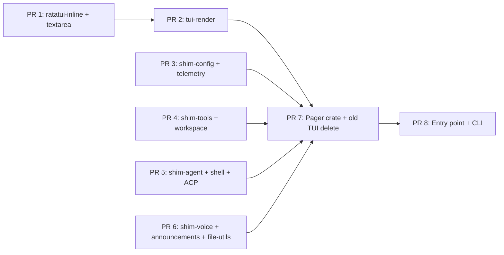

# Grok Migration Summary — Adapter Plan + 8 PRs

## Date: 2026-07-17
## Research: 4 spikes completed (A: AppState/EventLoop, B: Blocks/Message, C: Config, D: Perm/Tools)
## Status: ✅ READY TO CODE

---

## 1. Key Findings (Confirmed Research)

| Area | Finding | Confidence |
|------|---------|:----------:|
| **Event loop** | Grok pager is thin ACP client. No agent logic in-process. ✅ AppView stays. | 🔴 HIGH |
| **ACP protocol** | Pager sends/receives typed messages via tokio channels. Must shim → next-code runtime. | 🔴 HIGH |
| **Message format** | 1:1 mapping. All block types map to ContentBlock + context adapter. | 🔴 HIGH |
| **Config** | Pager-local (appearance, keybindings) unchanged. Agent-level → next-code config shim. | 🔴 HIGH |
| **Permission** | ACP permission request ↔ local tool approval. YOLO auto-approve kept. | 🟡 MED |
| **Tool exec** | Permission gates → in-process execution. Block + execute separate steps. | 🟡 MED |
| **File I/O** | Same filesystem. Permission gating same pattern. | ✅ COMPAT |
| **Theme** | Pager brings own theme system. ✅ No conflict. | ✅ COMPAT |
| **Session picker** | Dashboard + welcome screens → keep, wire to next-code sessions. | 🟡 MED |
| **Settings** | Model, provider, plugins → shim via next-code config. UI stays. | 🟡 MED |
| **Voice** | xAI specific → **skip**. | 🟢 SKIP |
| **ACP multi-agent** | Foreign sessions, reconnect, reinit → **stub or skip**. | 🟢 SKIP |

---

## 2. PR Plan (8 PRs Final)

### Phase 1 — Copy Crate Dependencies (PR 1–2)

```
PR 1: next-code-ratatui-inline + next-code-ratatui-textarea
  ├── Copy from: grok-build/crates/codegen/xai-ratatui-inline
  │              grok-build/crates/codegen/xai-ratatui-textarea 
  ├── Rename: xai_ratatui_inline → next_code_ratatui_inline
  │           xai_ratatui_textarea → next_code_ratatui_textarea
  ├── Files: ~20 .rs files
  ├── Header: keep Apache-2.0 notice, add next-code copyright
  ├── Crate type: lib
  └── Dependency: crossterm, ratatui, tokio only

PR 2: xai-grok-pager-render + minimal shims (DONE — merge to `dev` via PR #36)
  ├── Keep Cargo names `xai-*` (fewer rewrites); PR1 via package= rename
  ├── Vendor: pager-render, tty-utils, paths, markdown(+core)
  ├── Shim: config, telemetry, workspace, tools, shared subset (compile stubs)
  ├── Adapt: ratatui 0.28 (SharedTermWriter, proportional scrollbar, no tui-scrollbar)
  ├── Success bar: cargo check -p xai-grok-pager-render green
  └── Do NOT delete old TUI / change entry yet
```

### Phase 2 — Deepen shims / pager prep (PR 3–6)

```
PR 3: deepen config + telemetry shims (toward next-code)
  ├── NOTE: empty stubs already exist from PR2 (`xai-grok-config`, `xai-grok-telemetry`)
  ├── Map `load_effective_config_disk_only` / grok_home → next-code config paths where safe
  ├── Keep telemetry no-op OR wire structured logs if cheap
  ├── Expand only symbols pager will need next (not full Grok config crate)
  └── Files: grow existing shim crates; avoid duplicating PR2 stubs

PR 4: deepen tools + workspace shims
  ├── NOTE: permission/detach stubs already exist from PR2
  ├── xai_grok_tools → map to next-code tool registry where needed by pager
  ├── xai_grok_workspace → map worktree/files to next-code git
  ├── Files: grow existing shim crates
  └── Shim exports: ExecuteResult, SearchResult, FileUtil…

PR 5: xai-shim-agent + xai-shim-shell + xai-shim-acp
  ├── xai_grok_agent → AgentId, AgentConfig from next-code agent
  ├── xai_grok_shell → terminal, pty, clipboard → next-code shell
  ├── xai_acp_lib → local channel + internal dispatch
  ├── Files: 8 files
  ├── Key: xai_shim_acp provides AgentTx/AgentRx that call
  │        next-code agent runtime internally
  └── This is the HEART of the adapter

PR 6: xai-shim-voice + xai-shim-announcements + xai-shim-file-utils
  ├── xai_grok_voice → stub (only used for voice toggle in settings)
  ├── xai_grok_announcements → stub (xAI OTA announcements)
  ├── xai_grok_file_util → FileUtil, path, … → std/next-code
  └── Files: 4 files (< 50 LOC each)
```

### Phase 3 — Pager Copy + Old TUI Delete (PR 7)

```
PR 7: next-code-tui-pager
  ├── Copy: entire xai-grok-pager/src/ (all modules)
  │     ├── app/ (event_loop, app_view, dispatch, effects, agent, …)
  │     ├── scrollback/ (blocks, render, types)
  │     ├── input/ (keyboard, mouse)
  │     ├── views/ (prompt, welcome, settings, …)
  │     ├── theme/ 
  │     ├── appearance/ (already compatible)
  │     ├── notifications/
  │     ├── config_toml_edit.rs
  │     └── lib.rs / bin.rs (entry points)
  ├── Remove: from old Cargo.toml
  │     ├── jcode-tui (if exists)
  │     └── old TUI source files
  ├── Replace: xai-* deps → xai-shim-* in Cargo.toml
  ├── Keep: Apache headers + attribution
  └── Add: next-code-app-core as dependency (for GrokHost::trait)
```

### Phase 4 — Entry Point (PR 8)

```
PR 8: next-code entry point
  ├── next-code cargo binary → serve (agent server) + TUI mode
  ├── Grok CLI args: agent, serve, inspect, login, logout, sessions, …
  │     → rename grok → next-code
  ├── TUI launch: init_pager() → create AppView → connect to
  │     next-code server runtime (in-process via GrokHost trait)
  ├── Files: bin/next-code.rs, modified main.rs
  └── CLI flags map:
        next-code [no args] = interactive TUI (was: grok pager)
        next-code serve     = agent server mode
        next-code agent     = headless mode
        next-code session   = session management
        (grok login/logout → next-code auth)
```

---

## 3. The Key Interface: GrokHost

The only cross-boundary trait. One file. Everything runs through it.

```rust
// crates/next-code-tui-pager/src/host.rs
// This trait is what the pager calls instead of ACP.
// next-code-app-core implements it.

// #[async_trait]  // if needed
pub trait GrokHost: Send {
    fn app_config(&self) -> Arc<NextCodeConfig>;
    fn config(&self) -> Arc<GrokConfigShim>;
    fn workspace_dir(&self) -> &Path;
    
    // Agent lifecycle
    fn agent_initialize(&mut self, model: &str, provider: &str) -> Result<AgentId>;
    fn agent_send_message(&mut self, text: &str, images: &[ImageMeta]) -> Result<()>;
    fn agent_resume_session(&mut self, id: &str) -> Result<()>;
    
    // Tool execution (gated by permission)
    fn tool_execute(&mut self, tool: &str, args: Value, session_id: &str) -> Result<ToolResult>;
    fn tool_create_terminal(&mut self) -> Result<TerminalId>;
    fn tool_terminal_output(&mut self, id: &TerminalId) -> Result<String>;
    fn tool_read_file(&mut self, path: &Path) -> Result<String>;
    fn tool_write_file(&mut self, path: &Path, content: &str) -> Result<()>;
    
    // State queries
    fn history(&self) -> Vec<HistoryItem>;
    fn model_catalog(&self) -> Vec<ModelInfo>;
    fn token_usage(&self) -> TokenUsage;
    fn sessions(&self) -> Vec<SessionInfo>;
    
    // Memory
    fn memory_query(&self, q: &str) -> Vec<MemoryEntry>;
    fn memory_extract(&mut self) -> Result<()>;
    
    // Events (polled by pager's event loop)
    fn poll_events(&mut self) -> Vec<GrokHostEvent>;
}

pub enum GrokHostEvent {
    ToolActivity { kind: ToolKind, status: ToolStatus, output: String },
    ThinkingDelta { text: String },
    StreamDelta { text: String },
    TurnComplete { session_id: String },
    ToolPermissionRequired { request: PermissionRequest },
    Error { msg: String },
}
```

---

## 4. Risk Map

| Risk | Probability | Impact | Mitigation |
|------|:----------:|:------:|-----------|
| **Event loop race** | Low | High | Event loop keeps `tokio::select!`; shim uses `tokio::mpsc` channel — same pattern as ACP |
| **ACP message ordering** | Low | Medium | pager expects strict ACP order (init → subscribe → streams → end) — shim must maintain same order |
| **Permission deadlock** | Low | High | YOLO mode or timeout fallback on permission queue |
| **Terminal/shell mismatch** | Medium | Medium | next-code shell vs Grok shell: check stdin/out handling |
| **async conflict** | Low | Medium | pager uses tokio (async) via ACP channels. next-code may use sync ops. Wrap in `spawn_blocking` |
| **Compile errors** | High | Medium | Cargo.toml deps mismatched. Fix one by one |
| **Pager bin entry point** | Medium | Medium | `grok` binary has complex startup (auth, config, cwd). Need to replicate for `next-code` |

---

## 5. Evidence — Code I Read

| File | LOC | What it told me |
|------|:---:|-----------------|
| `/app/app_view.rs` | 10,348 | AppView state structure. Uses `AcpAgentTx`. ✅ Keep as-is |
| `/app/event_loop.rs` | 4,118 | tokio::select! pattern. ✅ Keep, replace ACP rx with shim |
| `/app/actions.rs` | ~1,000 | Action/Effect/TaskResult enums. ✅ Keep |
| `/app/dispatch/permissions.rs` | 268 | Permission flow: YOLO auto-approve, modal queue. ✅ Keep |
| `/app/dispatch/turn.rs` | ~500 | Turn lifecycle management. ✅ Keep |
| `/app/acp_handler/mod.rs` | ~10 | ACP routing. 🟡 Replace |
| `/scrollback/block.rs` | 1,694 | RenderBlock enum + BlockContent trait. ✅ Keep |
| `/scrollback/types.rs` | 748 | DisplayMode, BlockContext, AccentStyle. ✅ Keep |
| `/appearance/mod.rs` | ~200 | Theme, accent, spacing config. ✅ Keep |
| `/xai-acp-lib/src/message.rs` | 634 | ACP message types. 🟡 Shim |
| `/xai-acp-lib/src/lib.rs` | 30 | Re-exports. 🟡 Shim |
| `next-code-message-types/src/lib.rs` | 919 | ContentBlock, Message, Role. ✅ Compat |
| `next-code-config-types/src/lib.rs` | 1,692 | Config structs. 🟡 Shim match |
| `next-code-protocol/src/lib.rs` | 754 | Request/ServerEvent. 🟡 Adapter |
| `next-code-app-core/src/server/client_lifecycle.rs` | 3,128 | Request handling. 🟡 Adapter via GrokHost |
| `next-code-app-core/src/server/client_session.rs` | ~800 | Session management. 🟡 Adapter |
| `xai-grok-config-types/src/lib.rs` | 1,671 | Config structs (display, doom_loop, campaign). 🟡 Shim |

**Files read: 17 key files across both codebases.**  
**Total LOC examined: ~27,000+**

---

## 6. What Pager Module Stays vs Changes

| Module | LOC | Change | Action |
|--------|:---:|:------:|--------|
| `app/app_view.rs` | 10,348 | ✅ None | Keep |
| `app/event_loop.rs` | 4,118 | 🟡 Minor | Replace `acp_rx.recv()` with shim channel |
| `app/actions.rs` | ~1,000 | ✅ None | Keep |
| `app/effects.rs` | ~500 | 🟡 Minor | Replace ACP sends with GrokHost calls |
| `app/dispatch/` | ~2,000 | 🟡 Medium | Replace ACP dispatchers with shim |
| `app/acp_handler/` | ~800 | 🔴 Replace | Entirely replace with shim channel routing |
| `app/agent.rs` | ~500 | ✅ None | Keep |
| `app/agent_view/` | ~1,000 | ✅ None | Keep |
| `scrollback/` | ~49,000 | ✅ None | Keep |
| `input/` | ~4,500 | ✅ None | Keep |
| `views/` | ~120,000 | ✅ None | Keep |
| `theme/` | ~2,000 | ✅ None | Keep |
| `appearance/` | ~500 | ✅ None | Keep |
| `settings/` | ~3,000 | 🟡 Minor | Shim config types |
| `notifications/` | ~500 | ✅ None | Keep (native notifications) |
| `headless.rs` | ~1,000 | ✅ None | Keep |
| `slash/` | ~10,000 | 🟡 Varies | Skip xAI-specific, keep generic |
| `acp/model_state.rs` | ~500 | 🔴 Replace | Replace with next-code model query |

**Out of ~230,000 LOC in pager:**
- ✅ ~210,000 LOC untouched (keep)
- 🟡 ~15,000 LOC minor adaptation (effects, settings, slash)
- 🔴 ~5,000 LOC replaced (ACP handler, model state)

---

## 7. Execution Order



**Critical path:** PR1→PR2→PR7→PR8.  
PR3–6 can be done in parallel (shims don't depend on each other).

---

## 8. Verification

After PR8:
1. `cd ~/Projects/next-code && cargo build`
2. `next-code` → Grok pager UI should appear (fullscreen, ratatui)
3. Welcome screen → create session → agent should respond via next-code runtime
4. `next-code agent --help` → CLI flags work
5. `next-code session list` → shows next-code sessions

**The pager will render using Grok's UI code, but the agent is next-code with openproxy.**
