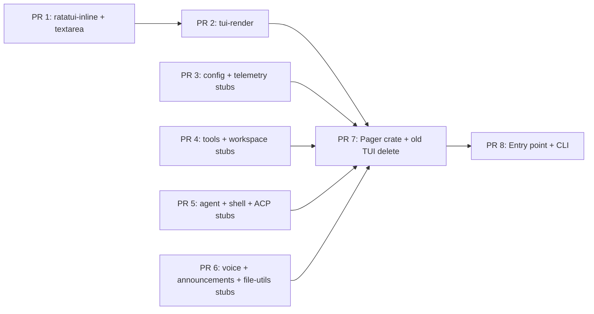

# Grok Migration Summary — Adapter Plan + 8 PRs

## Date: 2026-07-17
## Research: 4 spikes completed (A: AppState/EventLoop, B: Blocks/Message, C: Config, D: Perm/Tools)
## Status: ✅ READY TO CODE

---

## 1. Key Findings (Confirmed Research)

| Area | Finding | Confidence |
|------|---------|:----------:|
| **Event loop** | Grok pager is thin ACP client. No agent logic in-process. ✅ AppView stays. | 🔴 HIGH |
| **ACP protocol** | Pager sends/receives typed messages via tokio channels. Must shim → next-code runtime. | 🔴 HIGH |
| **Message format** | 1:1 mapping. All block types map to ContentBlock + context adapter. | 🔴 HIGH |
| **Config** | Pager-local (appearance, keybindings) unchanged. Agent-level → next-code config shim. | 🔴 HIGH |
| **Permission** | ACP permission request ↔ local tool approval. YOLO auto-approve kept. | 🟡 MED |
| **Tool exec** | Permission gates → in-process execution. Block + execute separate steps. | 🟡 MED |
| **File I/O** | Same filesystem. Permission gating same pattern. | ✅ COMPAT |
| **Theme** | Pager brings own theme system. ✅ No conflict. | ✅ COMPAT |
| **Session picker** | Dashboard + welcome screens → keep, wire to next-code sessions. | 🟡 MED |
| **Settings** | Model, provider, plugins → shim via next-code config. UI stays. | 🟡 MED |
| **Voice** | xAI specific → **skip**. | 🟢 SKIP |
| **ACP multi-agent** | Foreign sessions, reconnect, reinit → **stub or skip**. | 🟢 SKIP |

---

## 2. PR Plan (8 PRs Final)

### Phase 1 — Copy Crate Dependencies (PR 1–2)

```
PR 1: next-code-ratatui-inline + next-code-ratatui-textarea
  ├── Copy from: grok-build/crates/codegen/xai-ratatui-inline
  │              grok-build/crates/codegen/xai-ratatui-textarea 
  ├── Rename: xai_ratatui_inline → next_code_ratatui_inline
  │           xai_ratatui_textarea → next_code_ratatui_textarea
  ├── Files: ~20 .rs files
  ├── Header: keep Apache-2.0 notice, add next-code copyright
  ├── Crate type: lib
  └── Dependency: crossterm, ratatui, tokio only

PR 2: xai-grok-pager-render + minimal shims (DONE — merge to `dev` via PR #36)
  ├── Keep Cargo names `xai-*` (fewer rewrites); PR1 via package= rename
  ├── Vendor: pager-render, tty-utils, paths, markdown(+core)
  ├── Shim: config, telemetry, workspace, tools, shared subset (compile stubs)
  ├── Adapt: ratatui 0.28 (SharedTermWriter, proportional scrollbar, no tui-scrollbar)
  ├── Success bar: cargo check -p xai-grok-pager-render green
  └── Do NOT delete old TUI / change entry yet
```

### Phase 2 — Deepen shims / pager prep (PR 3–6)

```
PR 3: deepen config home → next-code (DONE — merged PR #37)
  ├── Map `grok_home` → `$GROK_HOME` > `$NEXT_CODE_HOME` > `~/.next-code` (dunce)
  ├── Keep empty `load_effective_config_disk_only` + no-op telemetry
  ├── Face display labels: `~/.next-code` / `$NEXT_CODE_HOME`
  └── No `[ui]` ↔ `[display].theme` bridge yet

PR 4: deepen tools + workspace shims (DONE — PR #38)
  ├── NOTE: Face already has detach / image_validate / enable-always-approve (PR2)
  ├── Grow compile stubs for top pager imports (ToolOutput, SessionMode, skills,
  │     ask_user_question, RestoreDegree, folder_trust, foreign_sessions empty…)
  ├── Do NOT wire next-code Registry / full Grok worktree runtime
  └── Keep ACP id `enable-always-approve` (YOLO map = PR5)

PR 5: xai-acp-lib + xai-grok-agent + xai-grok-shell (DONE — this PR)
  ├── NOTE: kept Cargo names `xai-*` (not `xai-shim-*`, per PR2-4 decision —
  │     the `xai-shim-*` naming below in this doc was stale/aspirational
  │     and never matched what PR2-4 actually shipped)
  ├── xai-acp-lib: vendored almost wholesale (8 files, channel/message/
  │     gateway/normalize/line_reader/stdin_reader) — AcpAgentTx/Rx,
  │     AcpClientTx/Rx, acp_send round-trip helper, message enums
  ├── xai-grok-agent: compile stub for the ~6 real pager import sites
  │     (agents_modal.rs + plugin_cmd.rs) — config::{BuiltinAgentName,
  │     AgentDefinition, AgentScope, PromptMode}, discovery::discover,
  │     plugins::{install_registry, manifest, git_install}
  ├── xai-grok-shell: frequency-ordered façade (NOT a wholesale vendor of
  │     upstream's ~434 files / ~14MB) — util::config (full RemoteSettings
  │     DTO, distinct from the tiny PR3 xai-grok-config stub), agent::config,
  │     auth (AuthMeta/GateInfo/AuthManager), sampling::{types, error},
  │     extensions::{notification, session_search, mcp, task, billing},
  │     top-level config (load_*/plugin toggles), util::{grok_home,
  │     clipboard (re-exports xai-grok-shared), with_locked_stderr,
  │     changelog, tips}, session (persistence/worktree/storage/merge/
  │     restore/repo_changes/prompt_queue/info + ContextInfo/PromptOrigin),
  │     models::default_model, tier::is_restricted_tier_name, active_sessions
  ├── Empty/no-op function bodies + Default-derived DTOs, matching the
  │     PR3/PR4 stub convention — no real disk/git/MCP/auth-network I/O
  ├── Did NOT wire AcpAgentTx/channels into next-code-agent-runtime or
  │     next-code-app-core's Registry — that stays PR8 (GrokHost)
  └── Kept ACP option id `enable-always-approve` unchanged (no YOLO remap)

PR 6: xai-grok-voice + xai-grok-announcements + xai-file-utils (DONE — this PR)
  ├── NOTE: crate names corrected vs the table above — pager's real Cargo dep
  │     is `xai-file-utils` / `xai_file_utils::`, not `xai-grok-file-utils` /
  │     `xai_grok_file_util`. "4 files / <50 LOC" was also outdated: upstream
  │     announcements is one real lib.rs, voice is ~15 files, file-utils is
  │     ~15 files (S3/GCS/auth machinery) — Option C (narrow) was used instead
  │     of full vendor.
  ├── xai-grok-announcements: vendored near-verbatim (types + pure helpers) —
  │     RemoteAnnouncement, AnnouncementCta, AnnouncementsRefreshed, hide-key
  │     logic, filter_expired/prune_hidden_announcement_ids, hidden-ids
  │     read/write. Persistence routed through xai_grok_config::grok_home
  │     (PR3) instead of upstream's xai_grok_tools::util::grok_home. Dropped
  │     the ts-rs binding feature/export test (unused in this workspace).
  ├── xai-grok-voice: compile stub, no audio. Vendored near-verbatim (pure):
  │     error.rs, event.rs, config.rs (VoiceConfig + from_config_table/
  │     stt_ws_url), language.rs (full STT_LANGUAGES catalog + helpers).
  │     Adapted: auth.rs (SharedVoiceAuth/StaticVoiceAuth, dropped the
  │     audio-gated require_bearer), pipeline.rs (VoiceCommand/
  │     run_voice_pipeline now a no-op that drains until Shutdown). Hard
  │     `AUDIO_SUPPORTED = false` — no audio feature, no cpal, no mic/STT
  │     network calls anywhere in the crate. Did not vendor audio/, stt/,
  │     probe.rs, bin/voice_probe.rs (no pager import needs them).
  ├── xai-file-utils: façade for exactly the 3 pager import sites —
  │     workspace_classifier::is_project_dir (ported faithfully, pure
  │     fs-existence/path-matching logic), gcs::upload_bytes (stub, always
  │     Err, no GCS/S3 client or network dep), trace_context::
  │     span_from_meta_traceparent (no-op span, no OpenTelemetry dep). Did
  │     NOT vendor queue/storage_client/s3/circuit_breaker/events/auth.
  ├── pager-render currently has zero imports from any of the three crates
  │     (same as PR5) — these are prep for PR7, not wired into any binary yet.
  └── Did NOT touch next-code-agent-runtime / next-code-app-core, the old
        TUI, or the ACP `enable-always-approve` option id.
```

### Phase 3 — Pager vendor (PR 7) — DONE (merged #41)

```
PR 7: xai-grok-pager (keep Cargo name; do NOT delete old TUI here)
  ├── Copy: entire xai-grok-pager/src/ into crates/xai-grok-pager
  ├── Stub missing Face deps; cargo check green
  └── Deferred to PR8: binary cutover + delete old TUI
```

### Phase 4 — Entry Point (PR 8) — DONE (merged #42 → `dev`)

```
PR 8: next-code entry point
  ├── next-code [no args] → xai-grok-pager::app::run (Face)  ✅
  ├── Brain: NextCodeFaceAgent ACP bridge → serve socket   ✅
  ├── Escape: NEXT_CODE_LEGACY_TUI=1 → old next-code-tui    ✅
  ├── Branding: welcome logo = next-code-tui-anim donut    ✅
  ├── Quit/resume brand + black-screen drain fix           ✅
  └── next-code-tui* still in workspace → delete in PR11
```

### Phase 5 — Finish migration (PR 9–14) — DOCS READY

Home-implementable plans (follow `.agents/skills/grok-migration-workflow`):

| PR | Doc |
|----|-----|
| Roadmap | `docs/plans/PLAN-20260720-grok-post-pr8-roadmap.md` |
| 9 Brain harden | `docs/plans/PLAN-20260720-grok-pr9-face-brain-harden.md` |
| 10 Config/settings | `docs/plans/PLAN-20260720-grok-pr10-face-config-settings.md` |
| 11 Retire legacy TUI | `docs/plans/PLAN-20260720-grok-pr11-retire-legacy-tui.md` |
| 12 Stub→real shell | `docs/plans/PLAN-20260720-grok-pr12-stub-to-real-shell.md` |
| 13 Sessions dashboard | `docs/plans/PLAN-20260720-grok-pr13-sessions-dashboard.md` |
| 14 Parity cleanup | `docs/plans/PLAN-20260720-grok-pr14-parity-cleanup.md` |

**Do not** implement SUMMARY §3 `GrokHost` unless ACP bridge fails — PR8 chose ACP mediator.
---

## 3. The Key Interface: GrokHost

The only cross-boundary trait. One file. Everything runs through it.

```rust
// crates/next-code-tui-pager/src/host.rs
// This trait is what the pager calls instead of ACP.
// next-code-app-core implements it.

// #[async_trait]  // if needed
pub trait GrokHost: Send {
    fn app_config(&self) -> Arc<NextCodeConfig>;
    fn config(&self) -> Arc<GrokConfigShim>;
    fn workspace_dir(&self) -> &Path;
    
    // Agent lifecycle
    fn agent_initialize(&mut self, model: &str, provider: &str) -> Result<AgentId>;
    fn agent_send_message(&mut self, text: &str, images: &[ImageMeta]) -> Result<()>;
    fn agent_resume_session(&mut self, id: &str) -> Result<()>;
    
    // Tool execution (gated by permission)
    fn tool_execute(&mut self, tool: &str, args: Value, session_id: &str) -> Result<ToolResult>;
    fn tool_create_terminal(&mut self) -> Result<TerminalId>;
    fn tool_terminal_output(&mut self, id: &TerminalId) -> Result<String>;
    fn tool_read_file(&mut self, path: &Path) -> Result<String>;
    fn tool_write_file(&mut self, path: &Path, content: &str) -> Result<()>;
    
    // State queries
    fn history(&self) -> Vec<HistoryItem>;
    fn model_catalog(&self) -> Vec<ModelInfo>;
    fn token_usage(&self) -> TokenUsage;
    fn sessions(&self) -> Vec<SessionInfo>;
    
    // Memory
    fn memory_query(&self, q: &str) -> Vec<MemoryEntry>;
    fn memory_extract(&mut self) -> Result<()>;
    
    // Events (polled by pager's event loop)
    fn poll_events(&mut self) -> Vec<GrokHostEvent>;
}

pub enum GrokHostEvent {
    ToolActivity { kind: ToolKind, status: ToolStatus, output: String },
    ThinkingDelta { text: String },
    StreamDelta { text: String },
    TurnComplete { session_id: String },
    ToolPermissionRequired { request: PermissionRequest },
    Error { msg: String },
}
```

---

## 4. Risk Map

| Risk | Probability | Impact | Mitigation |
|------|:----------:|:------:|-----------|
| **Event loop race** | Low | High | Event loop keeps `tokio::select!`; shim uses `tokio::mpsc` channel — same pattern as ACP |
| **ACP message ordering** | Low | Medium | pager expects strict ACP order (init → subscribe → streams → end) — shim must maintain same order |
| **Permission deadlock** | Low | High | YOLO mode or timeout fallback on permission queue |
| **Terminal/shell mismatch** | Medium | Medium | next-code shell vs Grok shell: check stdin/out handling |
| **async conflict** | Low | Medium | pager uses tokio (async) via ACP channels. next-code may use sync ops. Wrap in `spawn_blocking` |
| **Compile errors** | High | Medium | Cargo.toml deps mismatched. Fix one by one |
| **Pager bin entry point** | Medium | Medium | `grok` binary has complex startup (auth, config, cwd). Need to replicate for `next-code` |

---

## 5. Evidence — Code I Read

| File | LOC | What it told me |
|------|:---:|-----------------|
| `/app/app_view.rs` | 10,348 | AppView state structure. Uses `AcpAgentTx`. ✅ Keep as-is |
| `/app/event_loop.rs` | 4,118 | tokio::select! pattern. ✅ Keep, replace ACP rx with shim |
| `/app/actions.rs` | ~1,000 | Action/Effect/TaskResult enums. ✅ Keep |
| `/app/dispatch/permissions.rs` | 268 | Permission flow: YOLO auto-approve, modal queue. ✅ Keep |
| `/app/dispatch/turn.rs` | ~500 | Turn lifecycle management. ✅ Keep |
| `/app/acp_handler/mod.rs` | ~10 | ACP routing. 🟡 Replace |
| `/scrollback/block.rs` | 1,694 | RenderBlock enum + BlockContent trait. ✅ Keep |
| `/scrollback/types.rs` | 748 | DisplayMode, BlockContext, AccentStyle. ✅ Keep |
| `/appearance/mod.rs` | ~200 | Theme, accent, spacing config. ✅ Keep |
| `/xai-acp-lib/src/message.rs` | 634 | ACP message types. 🟡 Shim |
| `/xai-acp-lib/src/lib.rs` | 30 | Re-exports. 🟡 Shim |
| `next-code-message-types/src/lib.rs` | 919 | ContentBlock, Message, Role. ✅ Compat |
| `next-code-config-types/src/lib.rs` | 1,692 | Config structs. 🟡 Shim match |
| `next-code-protocol/src/lib.rs` | 754 | Request/ServerEvent. 🟡 Adapter |
| `next-code-app-core/src/server/client_lifecycle.rs` | 3,128 | Request handling. 🟡 Adapter via GrokHost |
| `next-code-app-core/src/server/client_session.rs` | ~800 | Session management. 🟡 Adapter |
| `xai-grok-config-types/src/lib.rs` | 1,671 | Config structs (display, doom_loop, campaign). 🟡 Shim |

**Files read: 17 key files across both codebases.**  
**Total LOC examined: ~27,000+**

---

## 6. What Pager Module Stays vs Changes

| Module | LOC | Change | Action |
|--------|:---:|:------:|--------|
| `app/app_view.rs` | 10,348 | ✅ None | Keep |
| `app/event_loop.rs` | 4,118 | 🟡 Minor | Replace `acp_rx.recv()` with shim channel |
| `app/actions.rs` | ~1,000 | ✅ None | Keep |
| `app/effects.rs` | ~500 | 🟡 Minor | Replace ACP sends with GrokHost calls |
| `app/dispatch/` | ~2,000 | 🟡 Medium | Replace ACP dispatchers with shim |
| `app/acp_handler/` | ~800 | 🔴 Replace | Entirely replace with shim channel routing |
| `app/agent.rs` | ~500 | ✅ None | Keep |
| `app/agent_view/` | ~1,000 | ✅ None | Keep |
| `scrollback/` | ~49,000 | ✅ None | Keep |
| `input/` | ~4,500 | ✅ None | Keep |
| `views/` | ~120,000 | ✅ None | Keep |
| `theme/` | ~2,000 | ✅ None | Keep |
| `appearance/` | ~500 | ✅ None | Keep |
| `settings/` | ~3,000 | 🟡 Minor | Shim config types |
| `notifications/` | ~500 | ✅ None | Keep (native notifications) |
| `headless.rs` | ~1,000 | ✅ None | Keep |
| `slash/` | ~10,000 | 🟡 Varies | Skip xAI-specific, keep generic |
| `acp/model_state.rs` | ~500 | 🔴 Replace | Replace with next-code model query |

**Out of ~230,000 LOC in pager:**
- ✅ ~210,000 LOC untouched (keep)
- 🟡 ~15,000 LOC minor adaptation (effects, settings, slash)
- 🔴 ~5,000 LOC replaced (ACP handler, model state)

---

## 7. Execution Order



**Critical path:** PR1→PR2→PR7→PR8.  
PR3–6 can be done in parallel (shims don't depend on each other).

---

## 8. Verification

After PR8:
1. `cd ~/Projects/next-code && cargo build`
2. `next-code` → Face pager UI should appear (fullscreen, ratatui) with **next-code** animated logo (not Grok braille art)
3. Welcome screen → create session → agent should respond via next-code runtime
4. `next-code agent --help` → CLI flags work
5. `next-code session list` → shows next-code sessions

**The pager will render using Grok's UI code, but branding (logo) and the agent are next-code (openproxy).**
