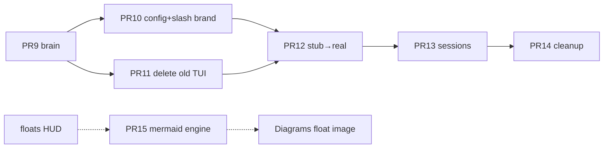

# Post-PR8 roadmap — finish Grok Face migration

**Date:** 2026-07-20 (audited vs `grok-migration-workflow`)  
**Base:** `dev` @ `f3f2ec470`+ (PR #42)  
**Skill:** `.agents/skills/grok-migration-workflow/SKILL.md`  
**Goal:** Replace next-code UI with Grok Face via **copy → delete old → wire**, prefer Grok UX over weaker next-code UI. Daemon = next-code brain.

## Workflow audit (2026-07-20)

| Skill requirement | Roadmap / PR9–14 before audit | After this refresh |
|-------------------|-------------------------------|--------------------|
| LOOK → PLAN → BUILD | Plans exist; Evidence mostly empty | Each PR has Evidence + Open questions slots |
| Explicit copy / delete / wire | Wire-heavy; Copy thin; Delete mostly PR11/14 | Tables strengthened; slash/brand = PR10 |
| Prefer Grok UI over next-code-tui | Implied | Explicit “keep Face UI; never re-home into TUI” |
| Clean old UI | PR11 | Unchanged; PR11 is the delete PR |
| Branding nextcode vs grok | Only quit hint (done PR8) | PR10 owns slash/URLs/titles; PR14 rg sweep |
| No GrokHost rewrite | Stated | Still out of scope |
| Verified citations before code | Weak | Required gate in every PR LOOK |

**Phase note:** PR1–8 already did bulk **Copy** (vendor Face). PR9–14 are mostly **Wire + Delete leftovers** — that is correct. “Copy” now means: copy **stock Face/grok-build behavior or pure helpers** at the seam, not re-vendor the pager.

## Done (PR1–8)

| PR | Outcome |
|----|---------|
| 1–7 | **Copy** Face substrate + stubs |
| 8 (#42) | **Wire** entry + ACP brain; logo; quit brand; legacy escape |

## Remaining PRs

| PR | Branch | Copy | Wire | Delete / clean | Plan |
|----|--------|------|------|----------------|------|
| **9** | `pr-9-face-brain-harden` | Stock Face ACP update/permission **patterns** | Daemon `ServerEvent` ↔ ACP | None (TUI stays) | [pr9](PLAN-20260720-grok-pr9-face-brain-harden.md) |
| **10** | `pr-10-face-config-settings` | Face settings/slash **UX** (keep) | `set_*` → next-code config; model catalog | Hide/remap xAI slash + grok.com URLs | [pr10](PLAN-20260720-grok-pr10-face-config-settings.md) |
| **11** | `pr-11-retire-legacy-tui` | — | CLI leftovers → Face | **Delete** legacy TUI path / re-exports | [pr11](PLAN-20260720-grok-pr11-retire-legacy-tui.md) |
| **12** | `pr-12-stub-to-real-shell` | Pure helpers from grok-build when needed | Stub body → next-code APIs | Defer dead stubs to PR14 | [pr12](PLAN-20260720-grok-pr12-stub-to-real-shell.md) |
| **13** | `pr-13-sessions-dashboard` | Face picker UI (keep) | List/open → `~/.next-code/sessions` | Fake foreign-session demos | [pr13](PLAN-20260720-grok-pr13-sessions-dashboard.md) |
| **14** | `pr-14-parity-cleanup` | — | Hotfix only | Dead stubs/crates; brand rg; close SUMMARY | [pr14](PLAN-20260720-grok-pr14-parity-cleanup.md) |

**Minimum ship:** PR9 + PR11. **Migration closed:** PR9–14.  
**Parallel polish (not renumbering 9–14):** **PR15** mermaid engine — see Related below.

## Order



## Per-PR gate (must pass before BUILD)

```
- [ ] LOOK done (DeepWiki / Face / seam) with verified citations in the PLAN Evidence section
- [ ] Copy / Wire / Delete table matches this roadmap
- [ ] No new Face rewrite; no re-homing into next-code-tui
- [ ] User OK / go ahead (or home implementer treats PLAN as approved scope)
- [ ] Manual smoke in that PLAN
```

## Related (post-roadmap polish)

| Item | Plan | Note |
|------|------|------|
| Face Context + KV floats (scroll-only HUD) | [PLAN-20260721-face-info-widget-floats.md](PLAN-20260721-face-info-widget-floats.md) | Copy legacy floats; wire Face; **show only while scrolling** (not PR9–14 gate); Diagrams stay text until mermaid PNGs |
| **PR15** Face mermaid / image engine | [PLAN-20260721-face-mermaid-engine.md](PLAN-20260721-face-mermaid-engine.md) | Branch `pr-face-mermaid-engine`. Un-stub PR7 `xai-grok-mermaid` (copy PureRust engine + wire `default_engine` / `__mermaid-render`). **Not** PR12/14/floats #45. Diagrams float image paint = follow-on after engine |

## Out of scope

- `GrokHost` trait rewrite  
- Voice / STT  
- grok.com foreign session sync  
- Replacing daemon auth with Grok cloud  
