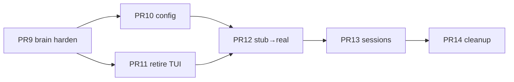

# Post-PR8 roadmap — finish Grok Face migration

**Date:** 2026-07-20  
**Base:** `dev` @ `f3f2ec470` (PR #42 merged)  
**Skill:** `.agents/skills/grok-migration-workflow/SKILL.md`  
**Goal:** Replace next-code UI with Grok Face via **copy → delete old → wire**, and prefer Grok UX/lifecycle over weaker next-code UI logic. Daemon stays next-code brain.

## Done (PR1–8)

| PR | Outcome |
|----|---------|
| 1–7 | Vendor Face substrate + stubs; pager compiles |
| 8 (#42) | Default entry = Face; `NextCodeFaceAgent` ↔ serve; logo; legacy escape; quit/resume brand fixes |

## Remaining PRs (implement at home)

| PR | Branch suggestion | One-liner | Plan file | Risk |
|----|-------------------|-----------|-----------|------|
| **9** | `pr-9-face-brain-harden` | Stream + tools + permissions over ACP bridge | [PLAN-…-pr9-…](PLAN-20260720-grok-pr9-face-brain-harden.md) | High |
| **10** | `pr-10-face-config-settings` | Face settings/slash → next-code config | [PLAN-…-pr10-…](PLAN-20260720-grok-pr10-face-config-settings.md) | Medium |
| **11** | `pr-11-retire-legacy-tui` | Remove default legacy path; start deleting `next-code-tui*` | [PLAN-…-pr11-…](PLAN-20260720-grok-pr11-retire-legacy-tui.md) | High |
| **12** | `pr-12-stub-to-real-shell` | Deepen `xai-grok-shell` stubs Face actually hits | [PLAN-…-pr12-…](PLAN-20260720-grok-pr12-stub-to-real-shell.md) | Medium |
| **13** | `pr-13-sessions-dashboard` | Session picker / dashboard / resume list parity | [PLAN-…-pr13-…](PLAN-20260720-grok-pr13-sessions-dashboard.md) | Medium |
| **14** | `pr-14-parity-cleanup` | Gaps + NOTICE + drop dead stubs; **close migration** | [PLAN-…-pr14-…](PLAN-20260720-grok-pr14-parity-cleanup.md) | Low–Med |

**Minimum to declare goal “shipped”:** PR9 + PR11 (+ smoke).  
**Recommended “migration closed”:** PR9–14.

## Order (do not reorder casually)

- **PR9 before PR11** — do not delete old TUI until chat/tools/permissions work on Face.
- **PR10 can parallel PR11** after PR9 lands (separate branches).
- **Skip GrokHost rewrite** unless ACP bridge proves insufficient (documented in each plan).

## How to implement each PR (house rules)

1. Read **grok-migration-workflow** skill.
2. Open that PR’s PLAN file; research grok-build / DeepWiki for the listed symbols.
3. Write/update the PLAN Status only if scope changes; then implement on the suggested branch from latest `dev`.
4. Manual smoke from the PLAN checklist before merge to `dev`.
5. Update `docs/grok-migration-SUMMARY.md` checkboxes when merged.

## Current known gaps (why these PRs exist)

| Gap | Where | Fixed in |
|-----|--------|----------|
| Prompt mostly text dump; weak tool/permission streaming | `src/cli/pager_agent.rs` | PR9 |
| Face settings write to shell stubs (no-ops) | `xai-grok-shell` `set_*` | PR10 / PR12 |
| Legacy TUI still shippable + `pub use next_code_tui::*` | `src/lib.rs`, `NEXT_CODE_LEGACY_TUI` | PR11 |
| Session dashboard / list UX | Face views + daemon list APIs | PR13 |
| Stub noise, brand leftovers | shells/tools stubs | PR12 / PR14 |

## Explicitly out of scope (unless you reopen)

- Full `GrokHost` trait rewrite (SUMMARY §3)
- xAI voice / mic (SUMMARY skip)
- Foreign multi-agent reconnect parity
- Replacing daemon/providers with Grok cloud auth
