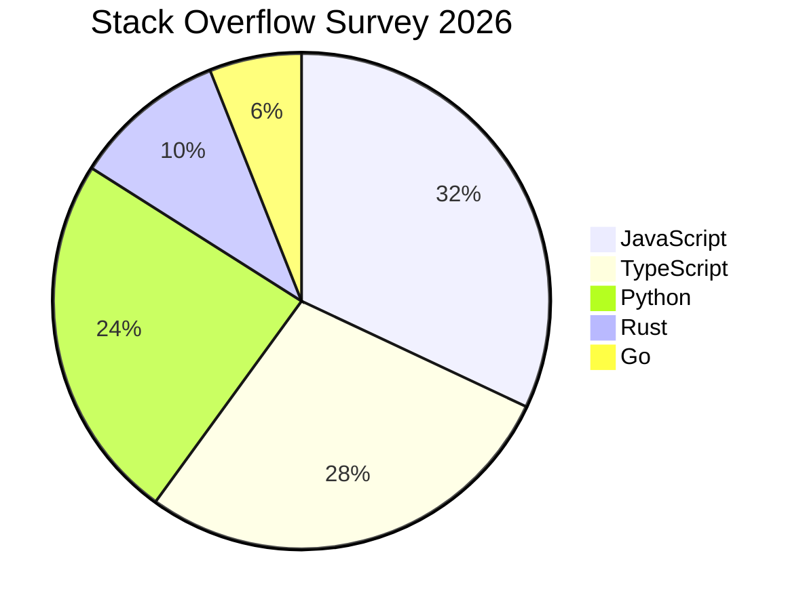
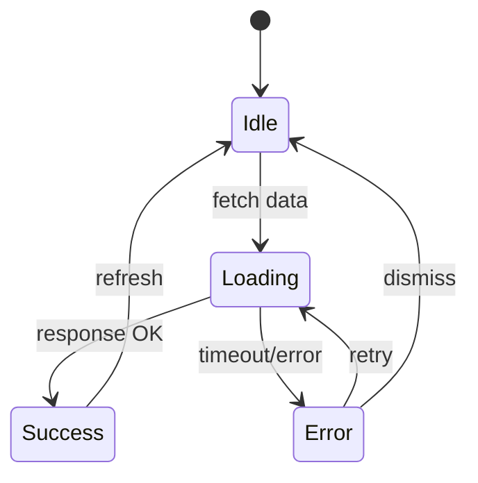
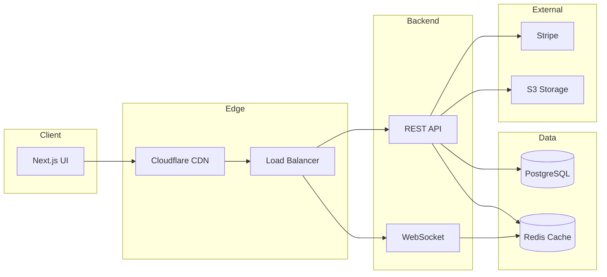
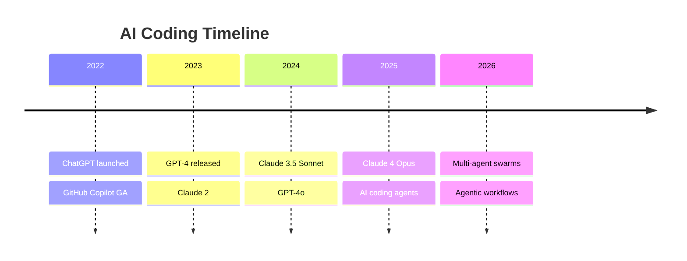
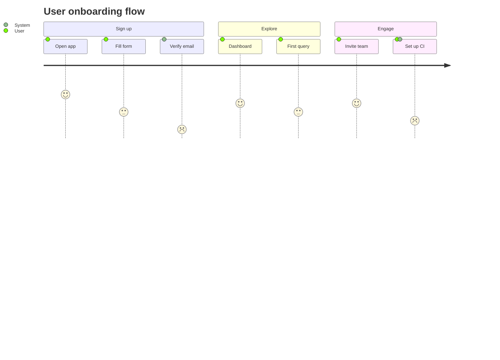
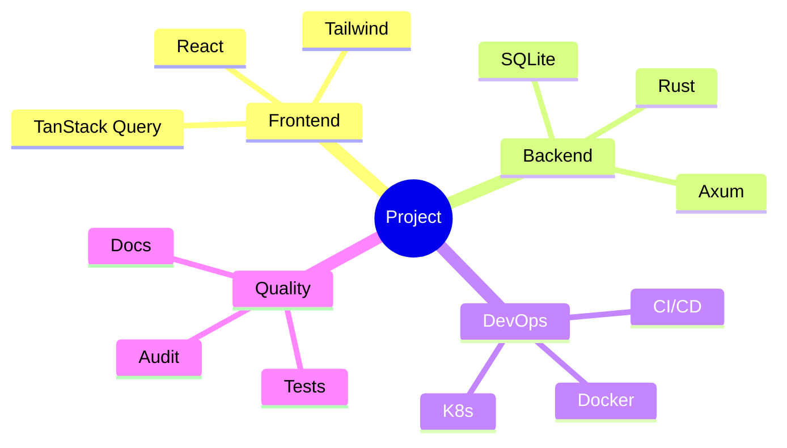
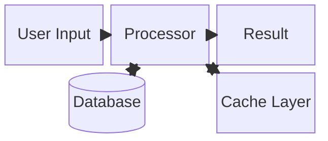
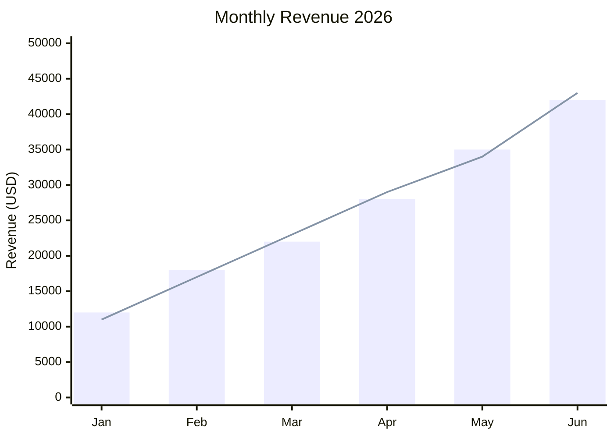
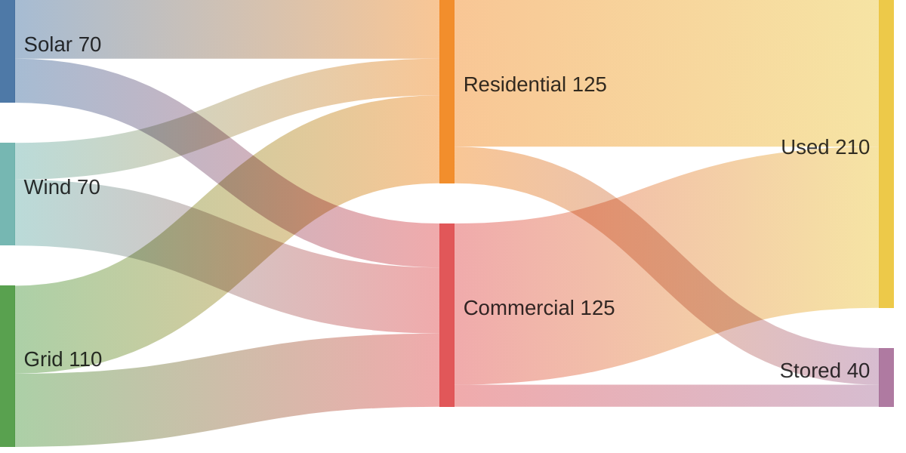

# Mermaid Sample — Advanced

## Pie Chart

## State Diagram

## Architecture (C4-style)

## Timeline

## User Journey

## Quadrant / Mind Map

## Block Diagram

## XY Chart

## Sankey (energy flow)

