# Mermaid Complete Reference

## 1. Flowchart — Luồng cơ bản

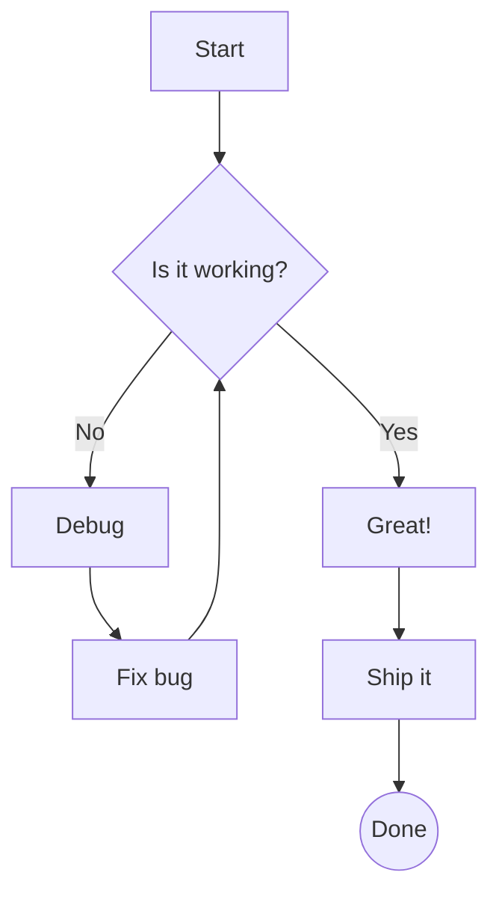

## 2. Sequence Diagram — Tương tác giữa các thành phần

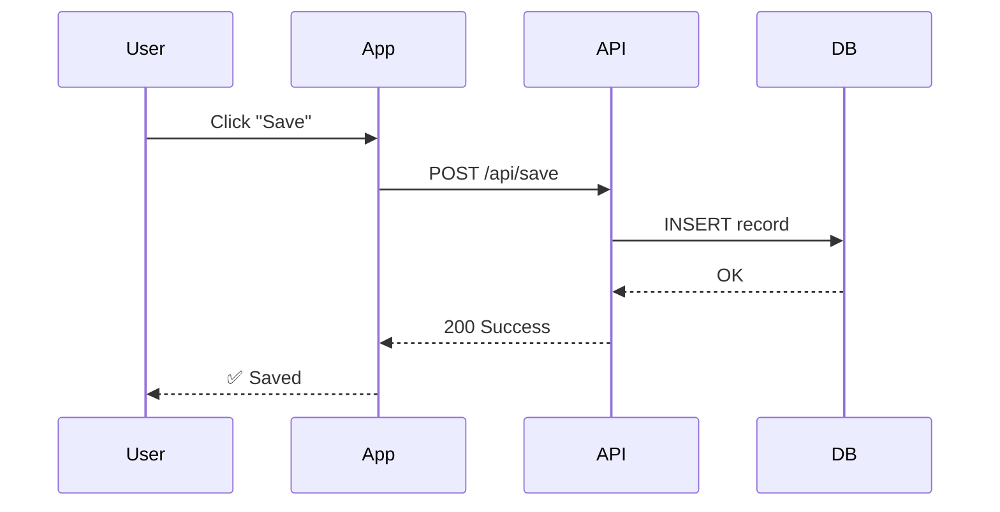

## 3. Class Diagram — OOP

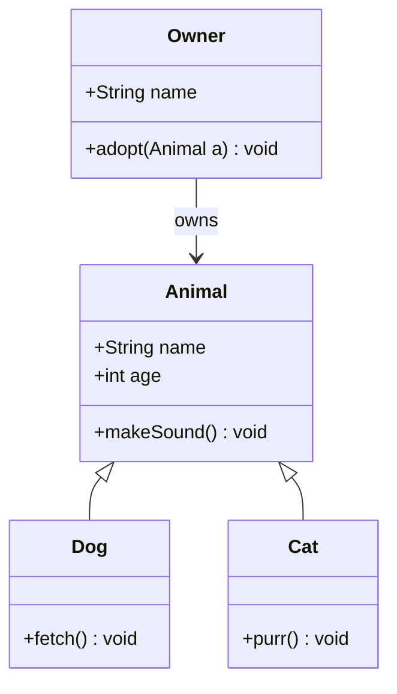

## 4. Git Graph

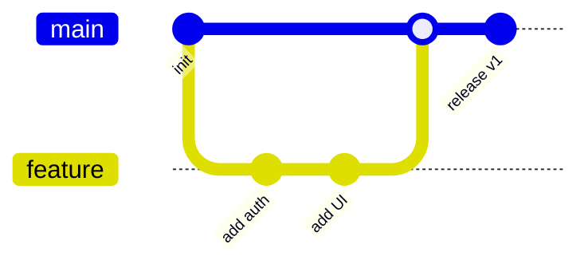

## 5. Gantt Chart — Timeline dự án

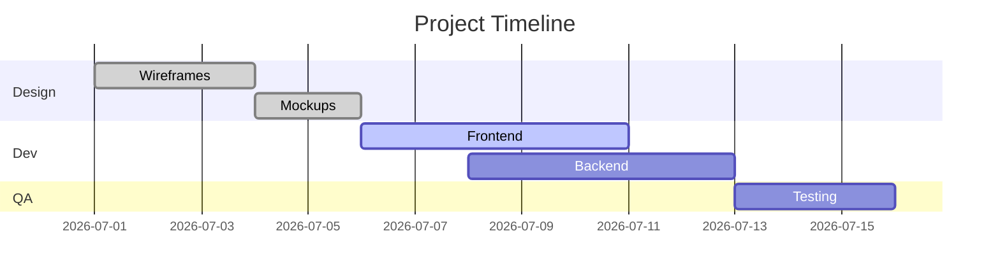

## 6. Entity Relationship — Database

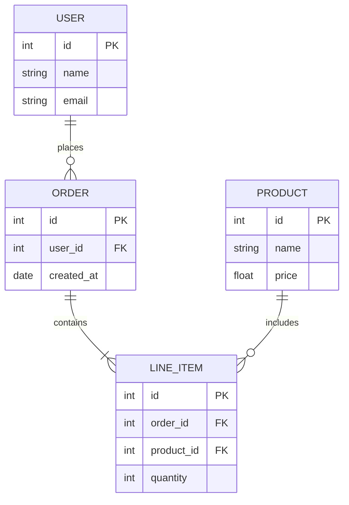

## 7. State Diagram — Trạng thái

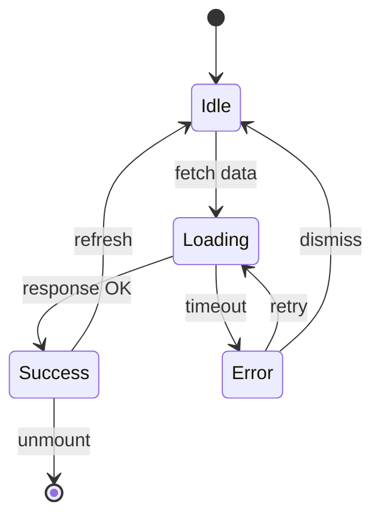

## 8. Pie Chart — Biểu đồ tròn

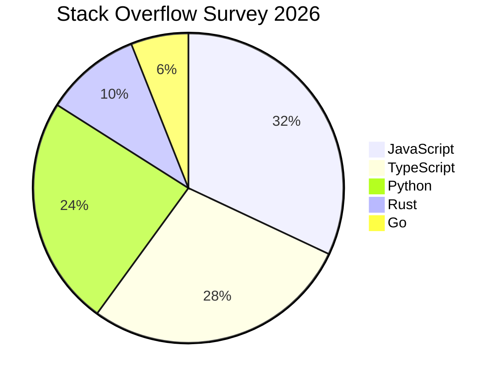

## 9. Timeline

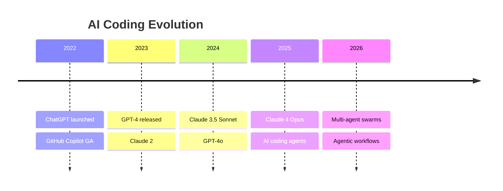

## 10. User Journey

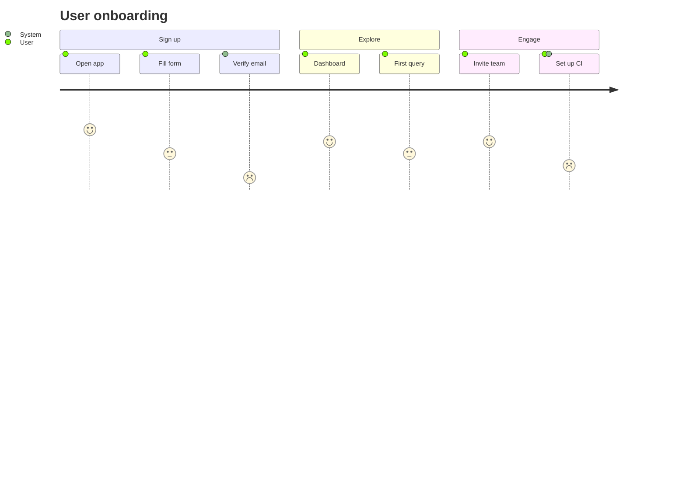

## 11. Mindmap

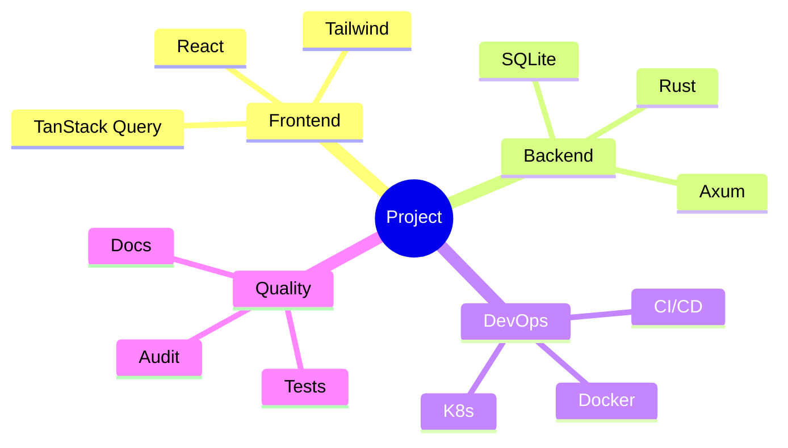

## 12. Block Diagram

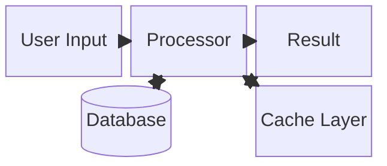

## 13. XY Chart

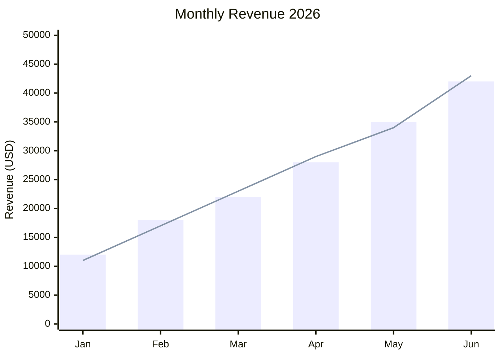

## 14 năng lượng

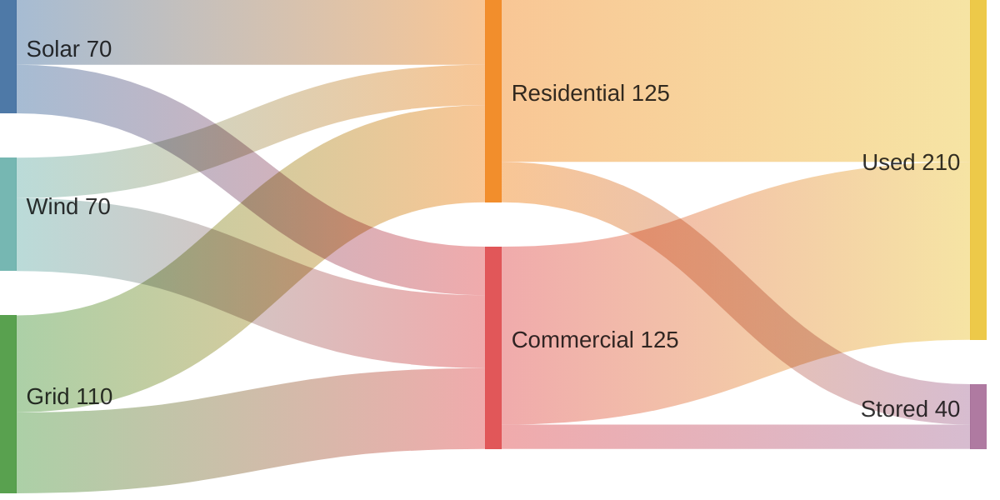

## 15. Package Diagram — C

```mermaid
packages-beta
    package "Frontend" {
        package "UI Components" {
            component Button
            component Table
            component Modal
        }
        package "Hooks" {
            component useAuth
            component useQuery
        }
    }
    package "Backend" {
        package "API" {
            component auth_handler
            component user_handler
        }
        package "DB" {
            component models
            component migrations
        }
    }
```

## 16. Requirement Diagram — Yêu cầu

```mermaid
requirementDiagram
    requirement req_auth {
        id: REQ-001
        text: "User must be able to login"
        risk: high
        verifymethod: test
    }
    requirement req_2fa {
        id: REQ-002
        text: "Support 2FA"
        risk: medium
        verifymethod: test
    }
    element login_form {
        type: interface
    }
    element otp_handler {
        type: backend
    }
    req_auth <- element login_form
    req_2fa <- element otp_handler
    req_2fa -refines -> req_auth
```

## 17. C4 Context — Kiến trúc tổng thể

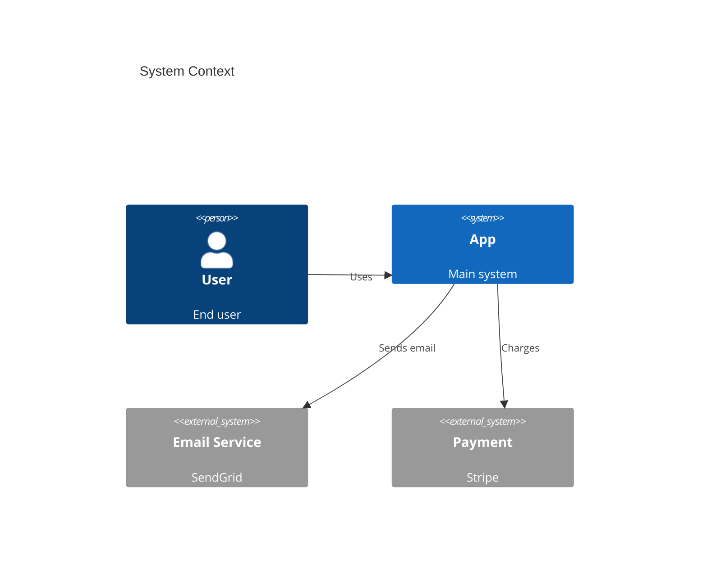

## 18. C4 Container — Chi tiết containers

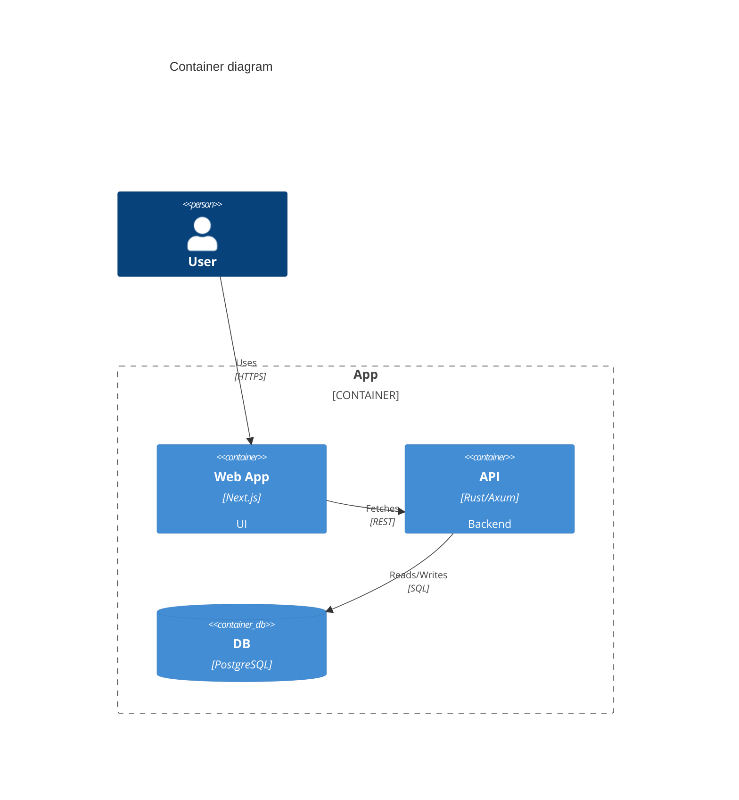

## 19. Quadrant Chart

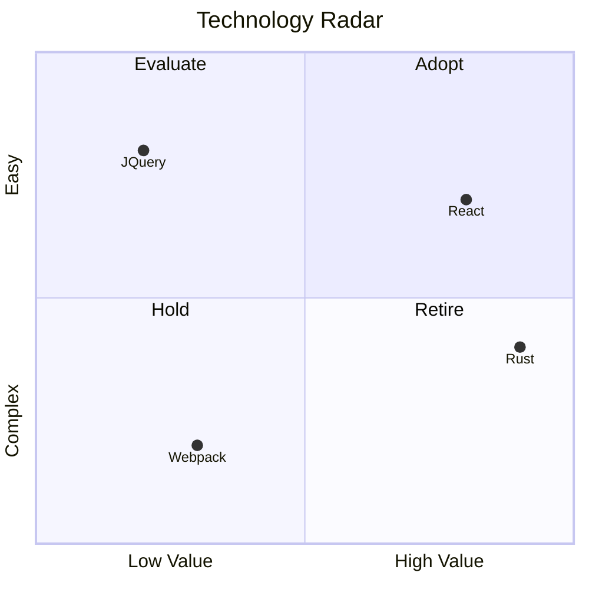

## 20. Flowchart Subgraphs — Luồng có nhóm

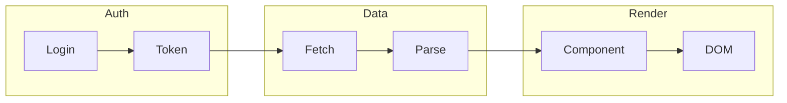

## 21. Flowchart với styling

```mermaid
flowchart LR
    A[Start] --> B[Process]
    B --> C{Check}
    C -->|Pass| D[✅ Done]
    C -->|Fail| E[❌ Error]

    style A fill:#4ade80,stroke:#16a34a,color:#000
    style C fill:#fbbf24,stroke:#d97706,color:#000
    style D fill:#4ade80,stroke:#16a34a,color:#000
    style E fill:#f87171,stroke:#dc2626,color:#000
```

## 22. Sequence với notes và activation

```mermaid
sequenceDiagram
    participant A as Client
    participant B as Server
    participant C as DB

    A->>+B: POST /data
    Note over A,B: SSL/TLS
    B->>+C: INSERT
    C-->>-B: row_id
    Note right of B: cache result
    B-->>-A: 201 Created
```

## 23. State Diagram với fork/join

```mermaid
stateDiagram-v2
    state fork_state <<fork>>
    state join_state <<join>>

    [*] --> fork_state
    fork_state --> Task1
    fork_state --> Task2
    Task1 --> join_state
    Task2 --> join_state
    join_state --> Done
    Done --> [*]
```
