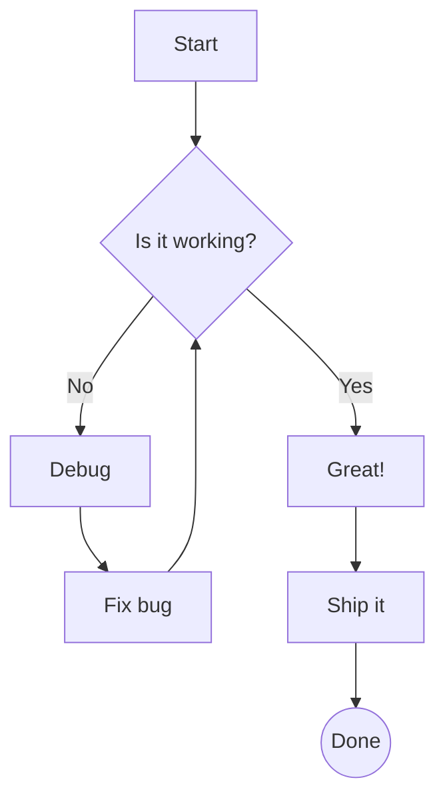
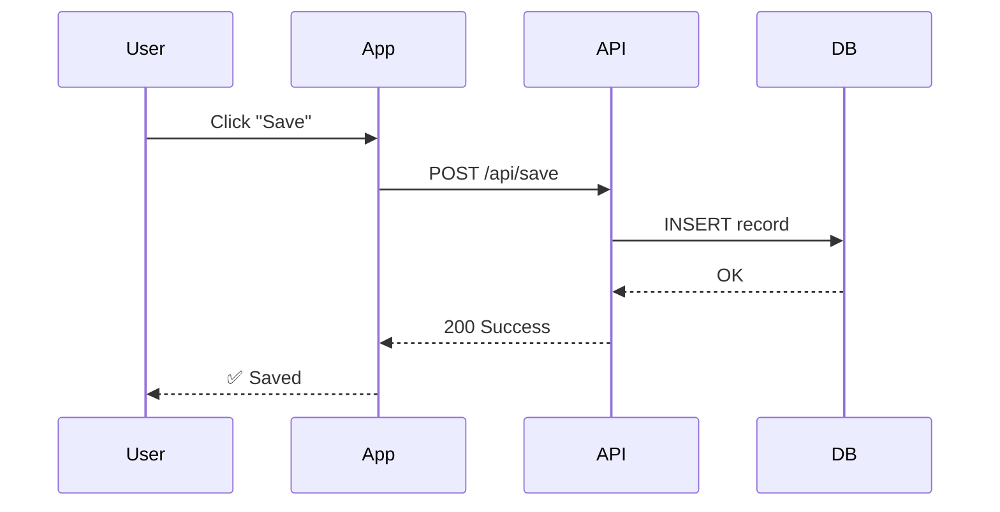
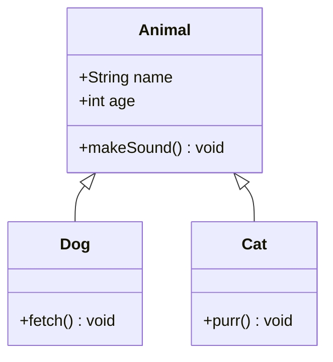
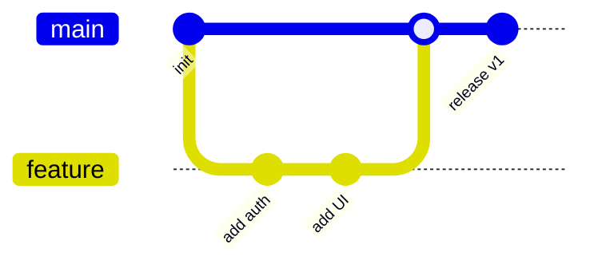
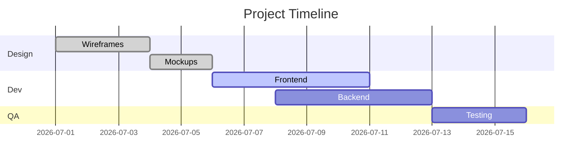
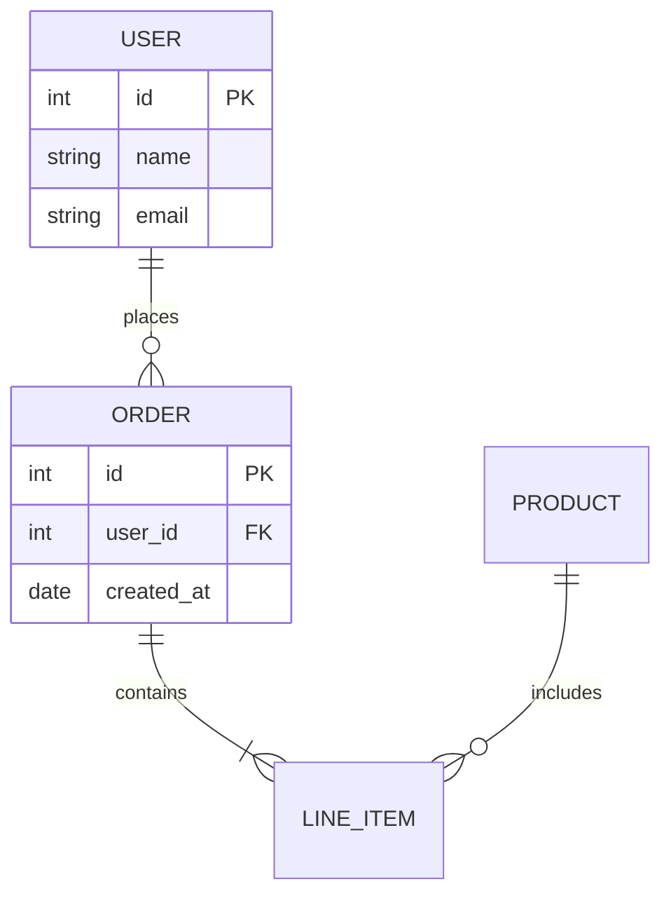

# Mermaid Sample

## Flowchart

```mermaid
flowchart TD
    A[Start] --> B{Is it working?}
    B -->|Yes| C[Great!]
    B -->|No| D[Debug]
    D --> E[Fix bug]
    E --> B
    C --> F[Ship it]
    F --> G((Done))
```

## Sequence Diagram

```mermaid
sequenceDiagram
    participant User
    participant App
    participant API
    participant DB

    User->>App: Click "Save"
    App->>API: POST /api/save
    API->>DB: INSERT record
    DB-->>API: OK
    API-->>App: 200 Success
    App-->>User: ✅ Saved
```

## Class Diagram

```mermaid
classDiagram
    class Animal {
        +String name
        +int age
        +makeSound() void
    }
    class Dog {
        +fetch() void
    }
    class Cat {
        +purr() void
    }
    Animal <|-- Dog
    Animal <|-- Cat
```

## Git Graph

```mermaid
gitGraph
    commit id: "init"
    branch feature
    checkout feature
    commit id: "add auth"
    commit id: "add UI"
    checkout main
    merge feature
    commit id: "release v1"
```

## Gantt Chart

```mermaid
gantt
    title Project Timeline
    dateFormat  YYYY-MM-DD
    section Design
    Wireframes      :done, 2026-07-01, 3d
    Mockups         :done, 2026-07-04, 2d
    section Dev
    Frontend        :active, 2026-07-06, 5d
    Backend         :2026-07-08, 5d
    section QA
    Testing         :2026-07-13, 3d
```

## Entity Relationship

```mermaid
erDiagram
    USER ||--o{ ORDER : places
    ORDER ||--|{ LINE_ITEM : contains
    PRODUCT ||--o{ LINE_ITEM : includes
    USER {
        int id PK
        string name
        string email
    }
    ORDER {
        int id PK
        int user_id FK
        date created_at
    }
```
